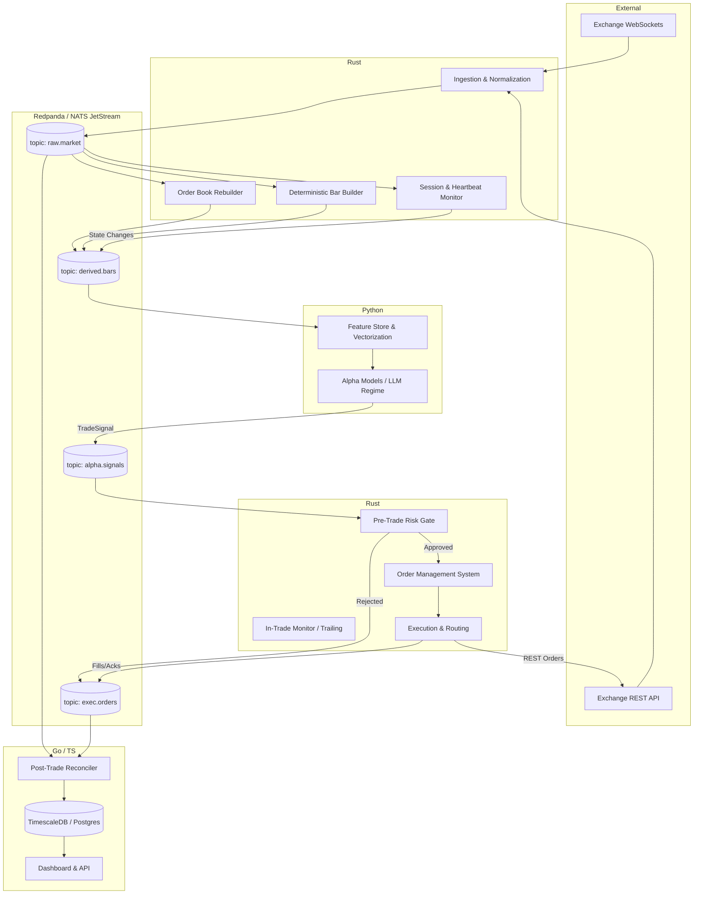

[Class diagrams vs Object diagrams in UML - Visual Paradigm Guides](https://guides.visual-paradigm.com/class-diagrams-vs-object-diagrams-in-uml/)
[UML Class Diagrams: An Agile Introduction](https://agilemodeling.com/artifacts/classdiagram.htm)
[What Is a Class Diagram? | microTOOL](https://www.microtool.de/en/knowledge-base/what-is-a-class-diagram/)
[UML Class Diagram: Use cases & examples](https://www.sparxsystems.eu/languages/uml/diagrams/classdiagram/)
[UML Class Diagram - GeeksforGeeks](https://www.geeksforgeeks.org/system-design/unified-modeling-language-uml-class-diagrams/)

That diagram is called a UML Class Diagram. It is a blueprint used to design and visualize the structure of software. [1, 2, 3, 4, 5]
A class diagram is drawn as a box with three parts: [6]

* Top: The name of the class (e.g., "Car").
* Middle: The attributes (data or variables, like "color" or "speed").
* Bottom: The methods (actions or functions, like "drive()" or "brake()"). [7, 8]

Lines connect these boxes to show how the different classes relate to each other. [9]
Would you like to learn more about how to read a class diagram, or are you interested in creating one for your own project?

[1] [https://www.visual-paradigm.com](https://www.visual-paradigm.com/guide/uml-unified-modeling-language/uml-class-diagram-tutorial/)
[2] [https://www.geeksforgeeks.org](https://www.geeksforgeeks.org/system-design/unified-modeling-language-uml-class-diagrams/)
[3] [https://en.wikipedia.org](https://en.wikipedia.org/wiki/Class_diagram)
[4] [https://creately.com](https://creately.com/guides/what-is-a-class-diagram/)
[5] [https://dev.to](https://dev.to/krishna-nayak/understanding-uml-class-diagrams-a-beginners-guide-2omj)
[6] [https://creately.com](https://creately.com/guides/class-diagram-relationships/)
[7] [https://www.drawio.com](https://www.drawio.com/docs/diagram-types/uml/class-diagrams/)
[8] [https://www.jointjs.com](https://www.jointjs.com/blog/uml-class-diagrams)
[9] [https://miro.com](https://miro.com/diagramming/what-is-a-uml-class-diagram/)

To successfully develop a software project, you typically need both structural diagrams (to show what is in the system) and behavioral diagrams (to show how the system works). Most of these belong to the Unified Modelling Language (UML) standard. [1, 2, 3, 4, 5]
Here are the most critical diagrams divided by their purpose:
## ⚙️ System Behavior & Logic
These diagrams show how data flows and how components interact over time. [6, 7, 8]

* Sequence Diagram: Shows how objects interact in a specific time order. It is crucial for mapping out step-by-step processes like user login or payment checkout. [9, 10, 11, 12, 13]
* Activity Diagram: Works like an advanced flowchart. It visualizes the operational workflow, business rules, and parallel choices within a system. [14, 15, 16, 17, 18]
* State Machine Diagram: Tracks the life cycle of a single object. It shows how an object changes states (e.g., an order moving from Pending to Shipped to Delivered) based on different events. [19, 20, 21, 22]

## 👥 User Interactions & Scope
These diagrams help you understand the project boundaries and what the user experiences. [23, 24]

* Use Case Diagram: Shows the relationships between system users (actors) and their goals (use cases). It defines high-level project requirements and scope. [25, 26, 27, 28, 29]

## 🏛️ System Architecture & Deployment
These diagrams move away from code and focus on hardware and physical file organization. [30, 31, 32]

* Component Diagram: Shows how code is broken down into modular pieces (like libraries, packages, or database modules) and how they depend on each other. [33, 34, 35, 36, 37]
* Deployment Diagram: Visualizes the physical hardware structure. It shows where software components are deployed, such as on web servers, cloud databases, or client devices. [38, 39, 40, 41, 42]

## 🗄️ Database Structure
While UML diagrams focus on code, you almost always need a dedicated diagram for data persistence. [43]

* Entity-Relationship Diagram (ERD): Specifically maps out your database tables, columns, primary keys, and data relationships. [44, 45, 46, 47, 48]

Would you like to see a simple example of a sequence diagram for a common feature like a login page, or should we look at an ERD for database planning?

[1] [https://creately.com](https://creately.com/blog/diagrams/uml-diagram-types-examples/)
[2] [https://www.alooba.com](https://www.alooba.com/skills/concepts/software-architecture-422/uml-and-design-documentation/)
[3] [https://www.ituonline.com](https://www.ituonline.com/tech-definitions/what-are-unified-modeling-language-uml-diagrams/)
[4] [https://creately.com](https://creately.com/guides/structural-and-behavioral-diagrams-in-uml/)
[5] [https://creately.com](https://creately.com/guides/uml-behavioral-diagrams/)
[6] [https://drawio-app.com](https://drawio-app.com/blog/uml-diagrams/)
[7] [https://www.smartdraw.com](https://www.smartdraw.com/diagramming/technical-diagramming.htm)
[8] [https://simpleprogrammer.com](https://simpleprogrammer.com/unified-modeling-language-age-of-agile/)
[9] [https://www.blobstation.com](https://www.blobstation.com/blog/conceptual-model-annotation-diagrams-for-srs-document)
[10] [https://link.springer.com](https://link.springer.com/content/pdf/10.1007/979-8-8688-2157-8_8.pdf)
[11] [https://www.gliffy.com](https://www.gliffy.com/blog/uml-2-5-diagram-types-and-templates)
[12] [https://plus.excalidraw.com](https://plus.excalidraw.com/use-cases/sequence-diagram)
[13] [https://www.figma.com](https://www.figma.com/resource-library/what-is-a-sequence-diagram/)
[14] [https://www.janbasktraining.com](https://www.janbasktraining.com/blog/activity-diagram-in-uml/)
[15] [https://www.visual-paradigm.com](https://www.visual-paradigm.com/guide/uml-unified-modeling-language/what-is-activity-diagram/)
[16] [https://www.getharvest.com](https://www.getharvest.com/blog/activity-diagram)
[17] [https://federicohaag.medium.com](https://federicohaag.medium.com/uml-unified-modeling-language-5a2a0c2fb973)
[18] [https://creately.com](https://creately.com/guides/activity-diagram-tutorial/)
[19] [https://www.rcet.org.in](https://www.rcet.org.in/uploads/files/LectureNotes/cse/S5/CS8592%20OBJECT%20ORIENTED%20ANALYSIS%20&%20DESIGN/Unit-3.pdf)
[20] [https://www.ituonline.com](https://www.ituonline.com/tech-definitions/what-are-unified-modeling-language-uml-diagrams/)
[21] [https://www.youtube.com](https://www.youtube.com/watch?v=_6TFVzBW7oo)
[22] [https://raphaeldelio.medium.com](https://raphaeldelio.medium.com/plantuml-the-missing-piece-in-your-projects-documentation-drawing-diagrams-with-text-ecf60fdc334a)
[23] [https://boardmix.com](https://boardmix.com/knowledge/types-of-architecture-diagram/)
[24] [https://openclassrooms.com](https://openclassrooms.com/en/courses/8371431-manage-your-project-using-v-model-methodology/8417362-clarify-requirements-with-diagrams)
[25] [https://nulab.com](https://nulab.com/learn/software-development/uml-diagrams-guide/)
[26] [https://www.productteacher.com](https://www.productteacher.com/quick-product-tips/uml-diagrams-for-product-managers)
[27] [https://creately.com](https://creately.com/guides/what-is-a-uml-diagram/)
[28] [https://knowhow.visual-paradigm.com](https://knowhow.visual-paradigm.com/openapi/use-case-diagram/)
[29] [https://study.com](https://study.com/academy/lesson/practical-application-for-software-engineering-uml-case-diagram.html)
[30] [https://www.mintlify.com](https://www.mintlify.com/library/when-and-how-to-use-diagrams)
[31] [https://www.csd.uoc.gr](https://www.csd.uoc.gr/~hy252/references/UML_for_Java_Programmers-Book.pdf)
[32] [https://quizlet.com](https://quizlet.com/760347824/cis-226-ch-13-flash-cards/)
[33] [https://clickup.com](https://clickup.com/blog/uml-diagram-templates/)
[34] [https://mck.agency](https://mck.agency/en/resources/blog/tecnologia/diagramas-uml-necesarios)
[35] [https://ones.com](https://ones.com/blog/mastering-component-dependency-diagrams-efficient-software-architecture/)
[36] [https://mockflow.com](https://mockflow.com/blog/What-is-Architectural-Diagramming)
[37] [https://www.naukri.com](https://www.naukri.com/code360/library/component-diagram)
[38] [https://clickup.com](https://clickup.com/blog/uml-diagram-templates/)
[39] [https://www.preplaced.in](https://www.preplaced.in/forums/while-approching-lld-30)
[40] [https://miro.com](https://miro.com/blog/sdlc-stages/)
[41] [https://mockflow.com](https://mockflow.com/blog/What-is-Architectural-Diagramming)
[42] [https://guides.visual-paradigm.com](https://guides.visual-paradigm.com/distinguishing-between-structure-and-behavior-diagrams-in-uml/)
[43] [https://www.ijisme.org](https://www.ijisme.org/wp-content/uploads/papers/v2i7/G0682062714.pdf)
[44] [https://creately.com](https://creately.com/guides/types-of-erd/)
[45] [https://medium.com](https://medium.com/omarelgabrys-blog/database-database-modeling-conceptual-design-part-4-645545a74a4b)
[46] [https://www.youtube.com](https://www.youtube.com/watch?v=o23LBJ-9jsU)
[47] [https://www.excelsoftware.com](https://www.excelsoftware.com/models)
[48] [https://giovanniberchmans29.medium.com](https://giovanniberchmans29.medium.com/database-design-project-secondary-school-database-with-mysql-111dccd21fd6)

To build a production-ready trading system with a paper exchange and dual data connections (REST and WebSockets), you need to plan your infrastructure, data models, and logic workflows beforehand. [1, 2]
Here is the checklist of foundational architectural diagrams, schemas, and specifications you should create before writing your core code.
## 📊 1. Architectural & Data Flow Diagrams

* System Architecture Diagram: A high-level blueprint showing how your trading bot/strategy, paper exchange, and live market data handlers connect. [3, 4]
* Sequence Diagram (Order Lifecycle): Maps out the exact time-ordered flow of an order: Strategy trigger $\rightarrow$ Risk check $\rightarrow$ Paper Exchange $\rightarrow$ Balance deduction $\rightarrow$ Execution confirmation. [5]
* Data Flow Diagram (DFD): Tracks how incoming WebSocket market data is processed, cached, and fed into your trading strategy in real-time.

## 🗄️ 2. Database & State Models

* Entity-Relationship Diagram (ERD): Definitive schema for your database tables (e.g., Users, Orders, Trades, Positions, Account_Balances).
* State Machine Diagram (Order States): Visually maps out legal transitions for order statuses (e.g., Pending $\rightarrow$ Partially Filled $\rightarrow$ Filled or Canceled). [6, 7, 8, 9]

## 🌐 3. Network & Connection Protocols

* WebSocket Event Matrix: A list mapping incoming real-time JSON payloads (like Orderbook L2 updates or live tickers) to system handlers.
* REST API Endpoint Specification: Documentation of your system's outbound REST calls (e.g., historical data fetching, manual order routing) and your paper exchange's internal REST endpoints. [10]

## 🛡️ 4. Risk & Failure Specifications

* Risk Engine Rule Matrix: A logical checklist of pre-trade checks (e.g., maximum order size, daily loss limits, available margin) that can reject an order before it hits the paper engine. [11, 12, 13, 14]
* Reconnection & Heartbeat Flowchart: Logic rules defining how your WebSockets handle network drops, missed heartbeats, and data gaps during reconnection.

Would you like to draft the database ERD schema for the paper exchange orders, or should we map out the WebSocket reconnection logic first?

[1] [https://www.metered.ca](https://www.metered.ca/blog/the-websocket-api-and-protocol-explained/)
[2] [https://www.youtube.com](https://www.youtube.com/watch?v=labFDo9iU_c)
[3] [https://passionatestar.com](https://passionatestar.com/learn-and-create-your-cab-booking-system-design-like-uber/)
[4] [https://fsc.stevens.edu](https://fsc.stevens.edu/cryptocurrency-market-making-improving-grid-trading-strategies-in-bitcoin/)
[5] [https://medium.com](https://medium.com/@edwinsalguero/data-pipeline-design-in-an-algorithmic-trading-system-ac0d8109c4b9)
[6] [https://www.orchidsinternationalschool.com](https://www.orchidsinternationalschool.com/class12-computer-science-ncert-solutions-chapter-8-database-concepts)
[7] [https://medium.com](https://medium.com/me-n-stack-development/20-full-stack-development-concepts-every-developer-must-master-796624543483)
[8] [https://www.browserstack.com](https://www.browserstack.com/guide/requirement-analysis)
[9] [https://medium.com](https://medium.com/codetodeploy/building-a-sub-millisecond-fx-hft-trading-bot-from-theory-to-production-part-i-38cbb94d18f7)
[10] [https://www.firebeetechnoservices.com](https://www.firebeetechnoservices.com/blog/binary-options-trading-bot)
[11] [https://www.linkedin.com](https://www.linkedin.com/pulse/order-management-system-oms-aakanksha-khare-safe-agilist-csm-ajyrf)
[12] [https://b2broker.com](https://b2broker.com/news/order-matching-engine/)
[13] [https://pickmytrade.io](https://pickmytrade.io/general-faq)
[14] [https://www.jainam.in](https://www.jainam.in/blog/what-is-trade-life-cycle/)

To give your AI coding agents the absolute clarity they need to write production-ready code without hallucinating or making flawed architectural assumptions, you need a System Design Specification Bundle. AI agents excel when they have strict boundaries, explicit data formats, and deterministic rules. [1, 2, 3]
Here is the complete checklist of every artifact you should define before prompting an AI agent to write the first line of code.
## 🧩 1. Core Data Structures & Models
AI agents need explicit types to prevent type-mismatch bugs across asynchronous boundaries. [4]

* Unified Order Book Schema: The exact data structure for your local L2/L3 order book cache (e.g., nested maps, sorted arrays, or red-black trees for bids and asks).
* Order & Trade Object Schemas: Exact JSON/Object definitions for an Order (id, symbol, side, price, quantity, status, timestamp) and a Trade (trade_id, order_id, execution_price, filled_quantity, fee). [5]
* Position & Balance State Schema: Data structure tracking active positions (entry price, size, unrealised PnL) and account balances (total, locked/margin, available). [6]

## 🌐 2. API & Network Contracts
Agents must know the exact payload structures, or they will invent fake API parameters. [7]

* REST Client Interface Spec: Explicit endpoints, query parameters, and expected response payloads for your external market data provider (e.g., GET /v1/klines?symbol=BTCUSDT&interval=1m). [8, 9]
* WebSocket Ingestion Spec: Exact JSON payload structures for incoming streams (e.g., Ticker, Trades, Orderbook diffs) and the authentication/subscription message formats. [10]
* Internal Paper Exchange REST Spec: The API endpoints your trading strategy will call to simulate live broker interactions (e.g., POST /api/v1/order, DELETE /api/v1/order/{id}).

## 🔄 3. Finite State Machines (FSM)
AI agents struggle with complex lifecycles unless given strict state transition rules. [11, 12]

* Order Lifecycle FSM: A matrix defining legal transitions. (e.g., An order in FILLED status cannot transition to CANCELED. A PENDING order cannot trigger a trade event until it becomes ACCEPTED).
* Connection Lifecycle FSM: Connection states for WebSockets (DISCONNECTED → CONNECTING → CONNECTED → AUTHENTICATED). Define what happens if a ping fails. [13]

## 🧮 4. Algorithmic & Engine Logic Rules
Deterministic business rules prevent the AI from generating logical loopholes in financial calculations.

* Paper Exchange Matching Engine Rules: The exact matching algorithm (e.g., Price-Time Priority FIFO). Specify execution rules: Does a limit order fill exactly when the market price touches it, or must it cross? How are partial fills handled?
* Pre-Trade Risk Engine Matrix: A strict checklist executed synchronously before an order is routed (e.g., Available_Balance >= (Price * Quantity) + Estimated_Fee).
* PnL and Margin Math Formulas: Explicit equations for calculating realized PnL, unrealized PnL, average entry price, and liquidation prices (if using leverage).

## 🛠️ 5. Infrastructure & Operational Constraints

* Thread & Async Concurrency Model: Specification of how components talk to each other without blocking the main event loop (e.g., WebSocket events push to a thread-safe Queue, Match Engine consumes from the Queue).
* Storage & Caching Strategy: Decisions on what stays in ultra-fast in-memory storage (e.g., active order books, current positions) versus what gets written asynchronously to a database (e.g., historical candles, trade logs).

To begin building this bundle for your AI agents, should we first define the Exact JSON Schemas for the WebSocket Market Data payloads, or should we outline the Pre-Trade Risk Engine Matrix rules?

[1] [https://aakashgupta.medium.com](https://aakashgupta.medium.com/how-to-build-ai-agents-from-scratch-in-2025-464dddd1da07)
[2] [https://www.thoughtworks.com](https://www.thoughtworks.com/insights/blog/generative-ai/reimagining-api-modernization-with-deterministic-ai-assisted-engineering)
[3] [https://blog.softbinator.com](https://blog.softbinator.com/using-ai-coding-agents-without-losing-control/)
[4] [https://meridian-model.ai](https://meridian-model.ai/articles/what-is-human-assisted-ai)
[5] [https://michaelsolati.com](https://michaelsolati.com/blog/i-built-an-ai-powered-ttrpg-adventure-generator-because-generic-hallucinations-are-boring)
[6] [https://angiejones.tech](https://angiejones.tech/writing-good-gherkin-enables-good-test-automation/)
[7] [https://www.alibabacloud.com](https://www.alibabacloud.com/blog/beyond-nginx-ingress-higress-as-the-kubernetes-gateway-for-the-ai-era_603010)
[8] [https://www.examtopics.com](https://www.examtopics.com/discussions/salesforce/view/306326-exam-certified-integration-architect-topic-1-question-135/)
[9] [https://www.linkedin.com](https://www.linkedin.com/pulse/why-a2a-conversation-layer-universal-commerce-cassiano-surek-tsmue)
[10] [https://garystafford.medium.com](https://garystafford.medium.com/fine-tuning-wav2vec2-for-real-time-deepfake-audio-detection-b72d7efebdd7)
[11] [https://www.ikangai.com](https://www.ikangai.com/agentic-workflows-in-ai-how-autonomous-agents-are-transforming-task-automation/)
[12] [https://www.dragon1.com](https://www.dragon1.com/ai-uml-state-machine-diagrams-software-architecture)
[13] [https://www.linkedin.com](https://www.linkedin.com/posts/sitalakshmi04_ai-agent-agentdevelopmentkit-activity-7352087913809006593-WAy_)


# The Spec-Driven Architecture: Governing Agentic Trading Systems from Blueprint to Deployment

The objective of this report is to provide a comprehensive System Design Specification Bundle tailored for the development of an agentic-based trading application. This framework is designed to enable AI coding agents to generate production-ready code by providing a deterministic environment that eliminates ambiguity. It encompasses not only static technical blueprints but also a dynamic set of advanced workflows for team-based agentic development, continuous maintenance, and iterative improvement. The scope explicitly covers the foundational elements required for a trading system featuring a paper exchange and dual data connections via REST and WebSockets, including the paper exchange itself, REST and WebSocket connections, order and connection lifecycles, a risk engine, a matching engine, and the AI coding agents that interact with them. The resulting specification bundle serves as both a technical design document for code generation and a living governance structure for the entire software development lifecycle.

## Foundational Pillars: Core Specification Artifacts for Deterministic Code Generation

To empower AI coding agents to produce reliable, production-grade code, it is imperative to establish a set of foundational artifacts that serve as an unambiguous source of truth [[162](https://github.com/Anioko/spec-driven-development)]. These artifacts must precisely define the system's structure, data formats, and external interactions, thereby preventing logical errors, type mismatches, and hallucinated assumptions that plague less structured approaches [[1](https://www.softwareseni.com/spec-driven-development-in-2025-the-complete-guide-to-using-ai-to-write-production-code/), [59](https://discuss.huggingface.co/t/ai-trading-assistant/173161)]. The core pillars of this specification bundle include meticulously defined data structures, explicit API contracts, and formalized communication protocols. Adhering to this structured approach, often referred to as Spec-Driven Development (SDD), fundamentally shifts the development paradigm from "vibe coding" to a methodical process where the specification dictates the implementation [[3](https://towardsdatascience.com/from-vibe-coding-to-spec-driven-development/), [124](https://developer.microsoft.com/blog/spec-driven-development-spec-kit)].

The first pillar is the definition of explicit data structures and models. AI agents require strict, machine-interpretable types to function correctly across asynchronous boundaries and complex business logic [[59](https://discuss.huggingface.co/t/ai-trading-assistant/173161)]. For a trading system, this involves creating detailed schemas for every object that represents a state or action within the platform. A critical component is the Unified Order Book Schema, which defines the local cache structure for market data. This schema must specify the underlying data structure—be it nested maps, sorted arrays, or more complex balanced trees like red-black trees—for both bid and ask sides to ensure efficient lookups and updates [[51](https://hosseinnejati.medium.com/the-order-matching-engine-price-time-priority-order-books-and-throughput-optimization-de5badb936f9), [169](https://www.reddit.com/r/algotrading/comments/hs5pf3/building_order_book_and_matching_engine_from/)]. Following this, the core transactional objects must be precisely defined. An `Order` object requires fields such as a unique identifier (`id`), financial instrument symbol (`symbol`), side (`BUY`/`SELL`), price, quantity, status, and timestamp [[219](https://github.com/alpacahq/alpaca-docs/blob/master/content/api-references/broker-api/trading/orders.md), [250](https://docs.alpaca.markets/us/docs/orders-at-alpaca)]. Similarly, a `Trade` object must capture the outcome of an execution, containing a `trade_id`, the associated `order_id`, the `execution_price`, the `filled_quantity`, and any applicable fees [[67](https://a115.co.uk/mark-to-market-pnl-calculation/)]. The system's state must also be captured through `Position` and `Balance` schemas. A `Position` object tracks active holdings with attributes like `entry_price`, `size`, and `unrealised_PnL` [[155](https://docs.lighter.xyz/trading/pnl-and-total-account-value)], while a `Balance` schema details account liquidity with fields for total, locked/margin, and available funds [[94](https://github.com/alpacahq/alpaca-docs/blob/master/content/api-references/broker-api/trading/positions.md)]. The open-source NautilusTrader project provides exemplary implementations of such data models, demonstrating their practical application in a real-world trading context [[61](https://nautilustrader.io/), [146](https://crates.io/crates/nautilus-polymarket)]. By defining these structures upfront using a formal language like Protocol Buffers (`.proto` files), developers and AI agents can generate consistent data classes across different programming languages, ensuring interoperability and reducing bugs [[11](https://buf.build/c2c/order-srv/file/4e16524460e745f39ff102be1188256b%3Ac2c/order/v1/order.proto), [14](https://protobuf.dev/programming-guides/proto3/)].

The second foundational pillar is the establishment of rigorous API and network contracts. AI agents cannot invent API parameters or endpoint behaviors; they must operate strictly within the confines of a well-defined contract [[59](https://discuss.huggingface.co/t/ai-trading-assistant/173161)]. This requires documenting two primary interfaces: outbound connections to external market data providers and internal APIs for the paper exchange simulation. For external REST APIs, the specification must detail every endpoint, its HTTP method, required and optional query parameters, headers, and the exact structure of request bodies and expected JSON responses [[9](https://www.shfe.com.cn/eng/services/Technology/TechnicalSpecificationResource/202509/P020250915323993265281.pdf), [133](https://swagger.io/specification/)]. Formalizing these contracts using the OpenAPI Specification (formerly Swagger) standard provides a machine-readable format that tools can use for validation, documentation generation, and even automated client/server code generation [[132](https://learn.openapis.org/), [227](https://specmatic.io/spotlight/contract-testing-using-openapi-specs-as-executable-contracts/)]. For instance, the Alpaca Trading API specifies endpoints for placing orders (`POST /v2/orders`) and retrieving position information (`GET /v2/positions`), and these would be fully documented in the spec [[94](https://github.com/alpacahq/alpaca-docs/blob/master/content/api-references/broker-api/trading/positions.md), [219](https://github.com/alpacahq/alpaca-docs/blob/master/content/api-references/broker-api/trading/orders.md)]. The same level of rigor applies to WebSocket ingestion. The specification must define the exact JSON payload structures for all incoming real-time streams, such as ticker updates, individual trade fills, and L2/L3 order book deltas [[151](https://docs.alpaca.markets/us/docs/websocket-streaming), [271](https://www.youtube.com/watch?v=Mv6c_9FqNx4)]. Furthermore, it must prescribe the authentication message format (e.g., a JSON object with an API key and signature) and the subscription message format required to request specific data feeds [[246](https://exchange-docs.crypto.com/exchange/v1/rest-ws/index.html)]. The Crypto.com Exchange API, for example, details a specific JSON structure for its WebSocket requests, including an `id`, `method`, and `params` object, which serves as a model for such specifications [[246](https://exchange-docs.crypto.com/exchange/v1/rest-ws/index.html)]. For institutional-grade systems, adopting the Financial Information eXchange (FIX) protocol is a strong recommendation. FIX provides a standardized messaging format for a vast range of trading activities, from sending a new order single (`New Order Single <D>`) to receiving an execution report (`Execution Report <8>`) [[28](https://www.onixs.biz/fix-dictionary/4.4/msgtype_d_68.html), [31](https://bjftradinggroup.com/how-fix-protocol-works/), [171](https://www.onixs.biz/fix-dictionary/4.4/msgtype_ae_6569.html)]. Numerous exchanges, including CME Group, B3, and Aquis Stock Exchange, publish detailed FIX 4.4 specifications, highlighting its industry-wide adoption and utility in reducing proprietary protocol complexity [[36](https://www.b3.com.br/data/files/1F/86/AC/12/06F58710240ED387AC094EA8/Trader%20FIX.SUITE%20Dictionary%20v2.1.pdf), [98](https://cmegroupclientsite.atlassian.net/wiki/display/EPICSANDBOX/Maker+API+Application+Layer+FIX+Message+Definitions), [177](https://aqx-web-prod-s3-public-read.s3.eu-west-2.amazonaws.com/Aquis_Stock_Exchange_FIX_Spec_v2_0_4d8b4a5b50.pdf)]. Leveraging such standards ensures the system can integrate with existing infrastructure and adhere to established financial messaging conventions.

Finally, the third pillar involves defining the system's architectural and behavioral contracts through diagrams and logic matrices. While data schemas define *what* the data looks like, behavioral diagrams define *how* components interact over time. UML Sequence Diagrams are invaluable for mapping out step-by-step processes, such as the complete flow of an order from strategy trigger through risk check, submission to the paper exchange, balance deduction, and final execution confirmation . This visualizes the interaction between actors (the trading strategy) and system objects (Risk Engine, Paper Exchange), clarifying the temporal ordering of operations . To complement this, UML Component Diagrams provide a high-level view of how the codebase is modularized into distinct pieces (e.g., Market Data Handler, Order Management Service, Risk Engine) and the dependencies between them . For database persistence, a dedicated Entity-Relationship Diagram (ERD) is essential. This diagram maps out the definitive schema for all database tables, including columns, primary keys, foreign keys, and the relationships between entities like Users, Orders, Trades, Positions, and Account Balances [[138](https://dlthub.com/context/source/polygon-finance), [143](https://gist.github.com/rmbell09-lang/01281551ac4672bd5d1a42bb58575144)]. This ensures that the data layer is designed cohesively before any database-specific code is written. Beyond diagrams, a Pre-Trade Risk Engine Matrix acts as a logical checklist of rules that must be executed synchronously before any order is routed to the paper exchange [[37](https://www.fia.org/sites/default/files/2024-07/FIA_WP_AUTOMATED%20TRADING%20RISK%20CONTROLS_FINAL_0.pdf)]. This matrix should list all relevant risk checks, such as verifying available margin against the order value plus estimated fees, checking daily loss limits, and enforcing position size constraints [[103](https://questdb.com/glossary/pre-trade-risk-checks/), [104](https://www.pico.net/products/data-and-trading-software/pre-trade-risk/)]. These specifications collectively form the bedrock of the System Design Specification Bundle, transforming the development process from one of exploration and guesswork into a precise engineering discipline guided by a shared, unambiguous source of truth.

| Specification Artifact | Purpose | Key Components |
| :--- | :--- | :--- |
| **Unified Order Book Schema** | Defines the in-memory data structure for real-time market depth. | Bid/Ask side representation (e.g., nested map, sorted array); Data structures for price levels and orders at each price. [[51](https://hosseinnejati.medium.com/the-order-matching-engine-price-time-priority-order-books-and-throughput-optimization-de5badb936f9), [169](https://www.reddit.com/r/algotrading/comments/hs5pf3/building_order_book_and_matching_engine_from/)] |
| **Core Object Schemas** | Provides explicit, typed definitions for all fundamental entities. | `Order`: id, symbol, side, price, quantity, status, timestamp. `Trade`: trade_id, order_id, execution_price, filled_quantity, fee. `Position`: entry_price, size, unrealised_PnL. `Balance`: total, locked, available. [[67](https://a115.co.uk/mark-to-market-pnl-calculation/), [94](https://github.com/alpacahq/alpaca-docs/blob/master/content/api-references/broker-api/trading/positions.md), [155](https://docs.lighter.xyz/trading/pnl-and-total-account-value)] |
| **REST API Contract** | Specifies the interface for all RESTful interactions. | Endpoints (URL paths), HTTP methods, query parameters, headers, request/response JSON schemas, and error codes. [[9](https://www.shfe.com.cn/eng/services/Technology/TechnicalSpecificationResource/202509/P020250915323993265281.pdf), [133](https://swagger.io/specification/)] |
| **WebSocket Ingestion Spec** | Defines the contract for real-time data streaming. | Authentication message format, subscription/unsubscription messages, and the exact JSON payload structure for all event types (ticker, trades, orderbook). [[151](https://docs.alpaca.markets/us/docs/websocket-streaming), [246](https://exchange-docs.crypto.com/exchange/v1/rest-ws/index.html), [271](https://www.youtube.com/watch?v=Mv6c_9FqNx4)] |
| **FIX Protocol Specification** | Standardizes messaging for institutional-grade integration. | Adopted FIX version (e.g., 4.4, 5.0); List of supported message types (e.g., New Order Single, Execution Report); Definition of required and custom tags. [[28](https://www.onixs.biz/fix-dictionary/4.4/msgtype_d_68.html), [98](https://cmegroupclientsite.atlassian.net/wiki/display/EPICSANDBOX/Maker+API+Application+Layer+FIX+Message+Definitions), [171](https://www.onixs.biz/fix-dictionary/4.4/msgtype_ae_6569.html)] |
| **Sequence Diagram** | Visualizes the time-ordered interaction between components for a key use case. | Actors and system objects involved; Messages exchanged in chronological order.  |
| **Component Diagram** | Illustrates the modular architecture and dependencies of the system. | Software components (e.g., Microservices, Libraries); Interfaces exposed by components; Dependency arrows showing inter-component relationships.  |
| **Entity-Relationship Diagram (ERD)** | Provides the definitive schema for the persistent data store. | Database tables/entities; Columns/attributes and their data types; Primary and foreign keys; Relationships (one-to-one, one-to-many, many-to-many). [[138](https://dlthub.com/context/source/polygon-finance), [143](https://gist.github.com/rmbell09-lang/01281551ac4672bd5d1a42bb58575144)] |
| **Pre-Trade Risk Matrix** | Acts as a logical rulebook for validating orders before execution. | List of risk checks (e.g., max order size, daily loss limit, margin requirement); Conditions and thresholds for each check; Action to be taken on failure (e.g., reject, flag). [[37](https://www.fia.org/sites/default/files/2024-07/FIA_WP_AUTOMATED%20TRADING%20RISK%20CONTROLS_FINAL_0.pdf), [103](https://questdb.com/glossary/pre-trade-risk-checks/), [104](https://www.pico.net/products/data-and-trading-software/pre-trade-risk/)] |

## Behavioral Frameworks: Defining System Lifecycles with Finite State Machines

While static data schemas and API contracts define the "what" of a system, behavioral frameworks are necessary to define the "how"—specifically, the complex, time-dependent state transitions that govern core system components. For an agentic trading application, the most critical lifecycles to formalize are those of an individual order and the network connection to the market data provider. AI agents, despite their power, struggle with complex, non-deterministic logic unless provided with strict, finite rules governing their behavior [[59](https://discuss.huggingface.co/t/ai-trading-assistant/173161)]. Finite State Machines (FSMs) are the ideal tool for this purpose, providing a clear, unambiguous, and exhaustive model of all possible states and the events that trigger valid transitions between them [[27](https://www.b2bits.com/fixopaedia/fixdic44/fields_by_tag_.html)]. By specifying these FSMs as part of the System Design Specification Bundle, development teams can prevent logical errors, race conditions, and undefined states that could lead to catastrophic failures in a live trading environment.

The Order Lifecycle FSM is paramount to the integrity of the entire trading system. An order does not exist in a single state; it progresses through a series of well-defined statuses as it is processed, matched, and ultimately filled or canceled. The specification must define a comprehensive state transition graph that leaves no room for ambiguity. Common states in a trading order lifecycle include `Pending`, `Accepted`, `PartiallyFilled`, `Filled`, `Canceled`, and `Rejected` [[219](https://github.com/alpacahq/alpaca-docs/blob/master/content/api-references/broker-api/trading/orders.md), [247](https://docs.delta.exchange/)]. The FSM's core value lies in defining the legal transitions between these states. For example, the specification would dictate that an order in a `Pending` state can transition to `Accepted` upon reaching the matching engine, or to `Rejected` if a pre-trade risk check fails. Once an order is `Accepted`, it can transition to `PartiallyFilled` if some, but not all, of its quantity is executed. From `PartiallyFilled`, it can transition back to `PartiallyFilled` as further executions occur, or to `Filled` when the final quantity is matched. Critically, the FSM enforces immutability; once an order reaches the `Filled` state, it cannot transition to `Canceled`. Likewise, a `Rejected` order has no path back to an active state. This prevents impossible scenarios and forces the generated code to implement logic that respects these business rules. The specification should present this logic as a matrix or a state transition table, clearly listing the current state, the triggering event (e.g., "Execution Report Received," "Cancel Request from Strategy"), and the resulting next state. This deterministic model serves as a powerful guide for AI agents, ensuring that the code they write correctly handles every possible permutation of the order's journey from inception to conclusion. The TT FIX schema files, for instance, implicitly define such lifecycles through the sequence of messages they describe, such as a `New Order Single` followed by an `Execution Report` [[30](https://library.tradingtechnologies.com/tt-fix/tt-fix-general/getting-started-tt-fix-general/system-overview/)].

Equally critical is the specification of the Connection Lifecycle FSM, particularly for the WebSocket connection used for real-time market data streaming. Network connectivity is inherently unreliable, and a trading application must be resilient to disconnections, latency spikes, and missed heartbeats [[5](https://www.shaped.ai/blog/gitops-for-ai-agents-versioning-your-retrieval-logic)]. The FSM provides a robust framework for defining the system's behavior during these common failure modes. The specification should define a set of core connection states, such as `DISCONNECTED`, `CONNECTING`, `CONNECTED`, and `AUTHENTICATED` [[232](https://www.interactivebrokers.com/campus/trading-lessons/websockets/)]. The transition from `DISCONNECTED` to `CONNECTING` is triggered by a system directive to establish a link. If the TCP handshake succeeds, the state moves to `CONNECTED`. At this point, the system sends an authentication message (e.g., subscribing to a private feed or sending credentials) and waits for a positive acknowledgment. Upon successful authentication, the state becomes `AUTHENTICATED`, indicating the connection is fully operational and ready to receive data. The FSM must also define the behavior during a failure. If the TCP connection drops while in the `CONNECTED` state, the FSM should define a reconnection strategy. This could involve a jittered exponential backoff mechanism, where the system waits for a progressively longer period before attempting to reconnect, to avoid overwhelming a potentially unstable network. The specification must also address heartbeat management. If the server sends a ping and no pong response is received within a predefined timeout, the connection is considered dead. The FSM would then dictate the transition back to the `DISCONNECTED` state, triggering the reconnection loop. Furthermore, the specification must include a protocol for handling data gaps. When a WebSocket reconnects, there may be a period of time for which no market data was received. The FSM should define a recovery procedure, such as requesting a full snapshot of the order book or recent trades from a REST API endpoint to resynchronize the local state before resuming the stream of incremental updates [[151](https://docs.alpaca.markets/us/docs/websocket-streaming), [271](https://www.youtube.com/watch?v=Mv6c_9FqNx4)]. By codifying these behaviors in an FSM, the specification bundle ensures that the AI-generated code implements a resilient and predictable connection-handling strategy, a non-negotiable requirement for any production-grade trading system.

Beyond the order and connection lifecycles, other system components can benefit from FSM specification. For example, the lifecycle of the paper exchange itself could be modeled, defining states like `INITIALIZING`, `RUNNING`, `PAUSED_FOR_REBALANCING`, and `SHUTTING_DOWN`. Transitions between these states could be triggered by administrative commands or specific market conditions simulated within the paper trading environment. Similarly, the lifecycle of a trading strategy could be managed, with states like `IDLE`, `ACTIVE`, `STOPPED`, and `BACKTESTING`. This level of formalism extends the principle of determinism throughout the system, making it more predictable and easier to debug. The use of UML State Machine Diagrams is highly recommended for visualizing these FSMs within the specification bundle . Such diagrams provide an intuitive way for human developers and AI agents to understand the complex behavioral rules governing the system. They make implicit logic explicit, turning abstract requirements into concrete, actionable rules for implementation. Ultimately, by embedding these behavioral frameworks directly into the specification, the development team establishes a robust foundation for building a system that is not only correct in its data handling but also resilient and predictable in its dynamic operation.

| FSM Component | States | Key Transition Events | Resulting Behavior / Rules |
| :--- | :--- | :--- | :--- |
| **Order Lifecycle FSM** | `Pending`, `Accepted`, `PartiallyFilled`, `Filled`, `Canceled`, `Rejected` | `ValidateAndSubmit`, `ExecutionReportReceived(filled_qty)`, `CancelRequestFromStrategy`, `PreTradeRiskCheckFailed` | Prevents illegal transitions (e.g., `Filled` -> `Canceled`). Defines logic for partial fills and final settlement. [[56](https://corporatefinanceinstitute.com/resources/career-map/sell-side/capital-markets/matching-orders/), [219](https://github.com/alpacahq/alpaca-docs/blob/master/content/api-references/broker-api/trading/orders.md), [247](https://docs.delta.exchange/)] |
| **Connection Lifecycle FSM** | `DISCONNECTED`, `CONNECTING`, `CONNECTED`, `AUTHENTICATED` | `StartConnection`, `TcpHandshakeSuccess`, `AuthenticationSuccess`, `NetworkDrop`, `HeartbeatTimeout` | Defines a jittered exponential backoff reconnection strategy. Mandates data gap recovery via a REST snapshot. [[5](https://www.shaped.ai/blog/gitops-for-ai-agents-versioning-your-retrieval-logic), [151](https://docs.alpaca.markets/us/docs/websocket-streaming), [232](https://www.interactivebrokers.com/campus/trading-lessons/websockets/)] |
| **Paper Exchange FSM** | `INITIALIZING`, `RUNNING`, `PAUSED_FOR_REBALANCING`, `SHUTTING_DOWN` | `SystemStartup`, `RebalanceCommandReceived`, `MarketDataUpdate`, `ShutdownSignal` | Ensures orderly startup/shutdown. Isolates the exchange from external market events during rebalancing. [[170](https://github.com/ismailfer/exchange-simulator)] |
| **Trading Strategy FSM** | `IDLE`, `ACTIVE`, `STOPPED`, `BACKTESTING` | `StartStrategy`, `StopStrategy`, `LoadBacktestData`, `SimulationComplete` | Segregates live trading logic from historical analysis. Manages resources efficiently based on the current mode. [[84](https://medium.com/@aulegabriel381/nautilustrader-grid-trading-strategy-full-backtesting-tutorial-in-python-9735cd3874cb), [85](https://dev.to/henry_lin_3ac6363747f45b4/nautilustrader-chapter-4-data-import-and-processing-5can)] |

## Engine Logic and Algorithmic Rules: The Business Logic Specification

The core functionality of a trading application—the engines that execute trades, manage risk, and calculate performance—is driven by a set of deterministic algorithmic rules. For an AI coding agent to generate production-ready code for these engines, these rules must be specified with absolute precision. Unlike user-facing features that can have some flexibility, the logic within matching, risk, and PnL engines is governed by strict mathematical formulas and business policies that leave no room for interpretation or improvisation. The System Design Specification Bundle must therefore contain a dedicated section that formally defines these algorithmic rules, serving as the definitive source for the AI agent's implementation. This includes specifying the order matching algorithm, detailing the pre-trade risk checks, and providing explicit formulas for all profit and loss calculations.

The Matching Engine is the heart of any exchange, responsible for pairing buy and sell orders. Its behavior must be explicitly defined in the specification. The two most common matching algorithms are Price-Time Priority (often implemented as First-In-First-Out or FIFO) and Pro-Rata [[48](https://github.com/tigeryant/order-matching-engine), [50](https://finchtrade.com/glossary/order-matching-algorithms)]. The specification must choose one and detail its precedence rules. For a Price-Time Priority system, the rule is straightforward: orders are matched starting with the best prices (highest bid for a sell order, lowest ask for a buy order). At the same price level, the order that arrived first is filled first [[51](https://hosseinnejati.medium.com/the-order-matching-engine-price-time-priority-order-books-and-throughput-optimization-de5badb936f9), [113](https://hkopp.github.io/2016/10/order-book-matching-algorithms)]. The specification should also define the mechanics of partial fills. For instance, if a large resting limit order is hit by a smaller aggressive market order, the specification must state that the aggressor's order is immediately filled for its entire quantity, and the resting limit order's remaining quantity is updated. If the aggressor's order is a larger limit order hitting a small resting limit order, the specification must define whether the resting order is completely filled (becoming `Filled`) and the aggressor's order becomes `PartiallyFilled` with its remaining quantity still active in the book. Some exchanges use hybrid or allocation-based algorithms, which might allocate a trade proportionally among multiple resting orders at the same price level [[261](https://www.researchgate.net/publication/407154159_Optimizing_Order_Matching_Engines_for_Modern_Electronic_Exchanges), [280](https://cmegroupclientsite.atlassian.net/wiki/spaces/EPICSANDBOX/pages/457218479)]. The specification for the paper exchange must state which algorithm is being used and provide a clear description of its logic, including how it handles edge cases like orders arriving simultaneously (which might be resolved by a microsecond timestamp or another tie-breaker rule). The choice of matching algorithm has significant implications for trading strategy profitability and market dynamics, making its precise definition a critical part of the specification [[111](https://pmc.ncbi.nlm.nih.gov/articles/PMC9803255/), [265](https://www.cftc.gov/sites/default/files/2019-03/Two%20Year%20Analysis_updated%20-%20ada.pdf)].

Parallel to the matching logic is the Pre-Trade Risk Engine, which acts as a gatekeeper, rejecting orders that violate predefined risk parameters before they ever reach the matching engine [[103](https://questdb.com/glossary/pre-trade-risk-checks/), [281](https://www.chicagofed.org/-/media/publications/policy-discussion-papers/2011/pdp2011-2-pdf.pdf)]. The specification must provide a comprehensive Risk Engine Rule Matrix that lists every check to be performed. These checks are typically configured based on regulatory requirements (like MiFID II or SEC Rule 15c3-5) and internal firm policies [[104](https://www.pico.net/products/data-and-trading-software/pre-trade-risk/), [273](https://www.linkedin.com/posts/rohit-pande-a492a456_compliance2026-esma-regulatoryupdate-activity-7429872589986111488-LrQw)]. The matrix should include checks for maximum order size, maximum position limits (both gross and net), exposure thresholds, and minimum available margin or buying power [[157](https://questdb.com/glossary/algorithmic-risk-controls/), [192](https://tradingtechnologies.com/compliance/risk-management/)]. For example, a rule might state: "IF `Available_Balance` < (`Price` * `Quantity` * `1.05`) + `Estimated_Fee` THEN `Reject_Order`". The '1.05' factor might represent a buffer for price slippage. The specification should also define checks related to order typessuch as ensuring a `Stop` order has a valid `stopPrice` relative to the current market price, or that a `Limit` order price is within acceptable bounds [[88](https://alpaca.markets/learn/13-order-types-you-should-know-about)]. The logic for these checks should be presented as a clear, conditional matrix, allowing the AI agent to generate code that performs each check synchronously and rejects the order with a specific reason code if any check fails. This proactive risk management is crucial for preventing costly mistakes, such as "fat finger" errors or unauthorized large positions, and is a cornerstone of modern trading system design [[158](https://www.bestexecution.net/equities-trading-focus-pre-trade-risk-controls-atif-zuberi/), [257](https://www.corporatesolutions.euronext.com/blog/risk/pre-trade-risk)].

Finally, the specification must include explicit formulas for calculating Profit and Loss (PnL), which is fundamental for strategy evaluation and risk management. Unrealized PnL reflects the potential gain or loss on currently open positions, while Realized PnL is the profit or loss from positions that have been completely closed [[69](https://www.blueguardian.com/blogs/pnl-meaning-in-trading-explained-profit-and-loss-guide-for-beginners), [74](https://nonbank.io/blog/profit-and-loss)]. The specification should provide the precise mathematical expressions for both. Unrealized PnL is typically calculated using a mark-to-market valuation method, where the position's value is marked to the current market price [[115](https://www.investopedia.com/terms/m/marktomarket.asp), [119](https://www.careerprinciples.com/resources/what-is-mark-to-market-mtm)]. The formula is generally: $$Unrealized\ PnL = (Mark\ Price - Entry\ Price) \times Signed\ Quantity$$ [[67](https://a115.co.uk/mark-to-market-pnl-calculation/), [70](https://library.tradingtechnologies.com/trade/algo-trading/excel-integration-with-tt/task-excel-integration-with-tt/calculating-realized-and-unrealized-p-l/)]. The specification must define what constitutes the "Mark Price" (e.g., the midpoint of the best bid and ask, or a last traded price). Realized PnL is calculated at the moment a position is closed. The formula is: $$Realized\ PnL = (Exit\ Price – Entry\ Price) \times Position\ Size – Commissions \pm Swaps$$ [[68](https://afterprime.com/glossary/realised-pnl), [203](https://resources.reluna.com/kb/pnl-methodology)]. The specification should also define how the average entry price is recalculated after partial closes or adds to an existing position. For leveraged products, the specification must include formulas for calculating liquidation prices, which depend on the initial margin, maintenance margin, and current unrealized PnL [[247](https://docs.delta.exchange/)]. By codifying these financial calculations into explicit, unambiguous formulas, the specification bundle ensures that the AI-generated code will perform these critical computations consistently and accurately, forming a reliable basis for all subsequent performance analysis and risk reporting.

| Engine/Rule Type | Specification Details | Example Formula/Rules |
| :--- | :--- | :--- |
| **Matching Engine** | Defines the order matching algorithm and its precedence rules. | **Algorithm:** Price-Time Priority (FIFO).<br>**Rule:** Best price first, then earliest order at the same price. Partial fills update the resting order's quantity. [[48](https://github.com/tigeryant/order-matching-engine), [51](https://hosseinnejati.medium.com/the-order-matching-engine-price-time-priority-order-books-and-throughput-optimization-de5badb936f9), [113](https://hkopp.github.io/2016/10/order-book-matching-algorithms)] |
| **Pre-Trade Risk Engine** | A matrix of conditional checks to be performed synchronously on every order. | **Check:** Available Margin >= (Price * Quantity * 1.05) + Fee.<br>**Action on Fail:** Reject Order with "INSUFFICIENT_MARGIN" reason code. [[103](https://questdb.com/glossary/pre-trade-risk-checks/), [104](https://www.pico.net/products/data-and-trading-software/pre-trade-risk/), [157](https://questdb.com/glossary/algorithmic-risk-controls/)] |
| **Unrealized PnL Calculation** | Explicit formula for calculating the mark-to-market value of open positions. | $Unrealized\ PnL = (Mark\ Price − Entry\ Price) × Position\ Size$ [[67](https://a115.co.uk/mark-to-market-pnl-calculation/), [70](https://library.tradingtechnologies.com/trade/algo-trading/excel-integration-with-tt/task-excel-integration-with-tt/calculating-realized-and-unrealized-p-l/), [71](https://azbit.com/helpdesk/futures-trading/articles/how-to-calculate-realized-and-unrealized-pnl)] |
| **Realized PnL Calculation** | Explicit formula for calculating the profit/loss of closed positions. | $Realized\ PnL = (Exit\ Price – Entry\ Price) × Position\ Size ± Swaps – Commissions$ [[68](https://afterprime.com/glossary/realised-pnl), [72](https://docs.oracle.com/en/industries/financial-services/banking-corporate-lending/14.8.1.0.0/clslt/calculating_realized_profit_and_loss.html), [203](https://resources.reluna.com/kb/pnl-methodology)] |
| **Average Entry Price** | Formula for updating the average cost basis after adding to or closing a position. | $(OldSize \times OldAvgPrice + FilledQty \times FillPrice) / (OldSize + FilledQty)$ [[70](https://library.tradingtechnologies.com/trade/algo-trading/excel-integration-with-tt/task-excel-integration-with-tt/calculating-realized-and-unrealized-p-l/)] |
| **Liquidation Price** | Formula for calculating the price at which a leveraged position will be automatically closed. | Based on `MaintenanceMargin`, `InitialMargin`, `EntryPrice`, and `PositionSize`. Specifics depend on venue rules. [[247](https://docs.delta.exchange/), [279](https://forum.alpaca.markets/t/alpaca-paper-trading-partial-order-fill/2683)] |

## Agentic Development Workflows: Versioning, Governance, and Feedback Loops

Creating a static specification bundle is only the first step. To support a collaborative, team-based agentic development process, the specifications themselves must become living artifacts that evolve over time. The research goal explicitly calls for advanced workflows covering versioning, feedback loops, incremental improvement, and maintenance. This necessitates moving beyond simple document storage and adopting a governance model that treats specifications with the same rigor as code. This involves establishing a disciplined workflow for managing changes, validating the output of AI agents, and fostering a culture of continuous improvement. Methodologies like Spec-Driven Development (SDD), GitOps, and CI/CD practices provide the conceptual foundation for this operational framework [[5](https://www.shaped.ai/blog/gitops-for-ai-agents-versioning-your-retrieval-logic), [162](https://github.com/Anioko/spec-driven-development), [244](https://www.augmentcode.com/guides/cicd-ai-agents-pipeline-integration)].

The cornerstone of this workflow is treating specifications as version-controlled assets. Just as developers use Git to track changes to source code, the entire specification bundle—including UML diagrams, API contracts, and logic matrices—should be stored in a Git repository [[5](https://www.shaped.ai/blog/gitops-for-ai-agents-versioning-your-retrieval-logic)]. This practice brings several benefits. It creates a complete audit trail of every change, allowing teams to understand why a particular rule was modified and who made the decision [[236](https://dac.digital/what-is-a-golden-dataset/)]. It enables branching and merging strategies, allowing multiple agents or developers to work on different features or enhancements in parallel without conflicting with each other [[206](https://www.notch.cx/post/versioning-ai-agents-in-production)]. Most importantly, it facilitates the management of "spec debt," which can accumulate when specifications are not properly maintained over time [[129](https://www.linkedin.com/pulse/spec-driven-development-evolution-way-forward-naresh-choudhary-51zuc)]. To bring order to these versions, the Semantic Versioning (SemVer) 2.0.0 standard should be adopted [[274](https://semver.org/)]. Under SemVer, a version number is expressed as MAJOR.MINOR.PATCH. A MAJOR version increment signifies incompatible or "breaking" changes to the specification—for example, renaming an API endpoint or changing the data type of a critical field in an order object. This signals to all dependent systems that they will need to be updated. A MINOR version increment indicates the addition of new functionality in a backward-compatible manner, such as introducing a new optional field in an API request. A PATCH version increment denotes backward-compatible bug fixes, like correcting a typo in a description. Automating semantic versioning based on commit messages or pull request titles can streamline this process significantly [[289](https://www.bitshifted.co/blog/automatic-semantic-versioning-cicd-pipelines/), [291](https://github.com/marketplace/actions/git-automatic-semantic-versioning)]. Furthermore, just as specifications are versioned, so too should the AI agents themselves be versioned. This allows teams to deploy, test, and roll back specific agent configurations with confidence, mirroring the CI/CD discipline applied to traditional software [[142](https://decagon.ai/blog/decagon-agent-versioning), [245](https://medium.com/@nraman.n6/versioning-rollback-lifecycle-management-of-ai-agents-treating-intelligence-as-deployable-deac757e4dea)].

A robust feedback loop is essential for validating the code generated by AI agents and ensuring it aligns with the original specification. One of the most effective mechanisms for this is the creation of a "Golden Dataset." A golden dataset is a curated collection of representative inputs and their corresponding, known-correct outputs [[25](https://ml-architects.ch/blog_posts/testing_qa_ai_eingineering.html), [224](https://www.getmaxim.ai/articles/building-a-golden-dataset-for-ai-evaluation-a-step-by-step-guide/)]. This dataset should cover a wide range of scenarios, including normal operations, edge cases, and error conditions. For the trading application, this could include sample valid order submissions, invalid orders that should be rejected by the risk engine, WebSocket messages simulating various market events, and historical data for backtesting. Every meaningful change to the specification or the generated code should trigger a regression test suite that runs the new agent against this golden dataset [[204](https://medium.com/@federicomoreno613/golden-datasets-the-foundation-of-reliable-ai-evaluation-486ce97ce89d), [225](https://www.techment.com/blogs/llm-regression-testing/)]. If the agent's output deviates from the expected result in the dataset, the change is flagged as a regression, preventing faulty code from being deployed [[19](https://getautonoma.com/blog/regression-testing-ai-generated-code), [21](https://arxiv.org/html/2603.17973v1)]. Another powerful technique is the use of "LLM Evals" or evaluations. An eval is a test that uses an LLM to score the output of another LLM or a piece of generated code against a predefined rubric [[23](https://www.anthropic.com/engineering/demystifying-evals-for-ai-agents)]. For example, an eval could be designed to verify that a newly generated API client adheres to the contract defined in the OpenAPI specification, or that a piece of Python code follows the project's established style guide and concurrency patterns [[228](https://www.linkedin.com/posts/walkadm_mcp-aiagents-llmops-activity-7450930793167638528-Rm_k)]. Traces captured from production failures can be used to create targeted eval datasets that specifically test for previously encountered bugs, turning production incidents into opportunities for improving the validation process [[20](https://www.arthur.ai/column/regression-test-datasets-ai-agents-production-failures)]. These feedback mechanisms, combined with automated validation tools that check specifications for correctness (e.g., validating an OpenAPI spec's schema) before code generation begins, create a multi-layered defense against regressions and implementation errors [[131](https://apinotes.io/blog/validate-openapi-spec-before-generating-code), [168](https://www.linkedin.com/pulse/reducing-ai-hallucinations-when-generating-openapi-mark-sivill-reuye)].

Finally, the workflow must support continuous improvement and long-term maintenance. This involves establishing an iterative refinement loop for the generated code. It is unrealistic to expect an AI agent to produce perfect, optimized code in a single pass. The LLMLOOP framework, for example, outlines a process of iteratively resolving issues by addressing compilation errors, fixing static analysis warnings, debugging failing tests, and improving the quality of the tests themselves [[166](https://valerio-terragni.github.io/assets/pdf/ravi-icsme-2025.pdf), [167](https://www.researchgate.net/publication/394085087_LLMLOOP_Improving_LLM-Generated_Code_and_Tests_through_Automated_Iterative_Feedback_Loops)]. This cyclical process continues until the generated code meets a predefined quality bar. The specification bundle plays a crucial role here, as it defines the "quality bar"—the functional and non-functional requirements that the code must satisfy. For maintenance, the specification must include clear documentation on operational protocols, such as procedures for handling WebSocket reconnections, strategies for data persistence and caching, and guidelines for scaling the system [[62](https://www.sciencedirect.com/org/science/article/pii/S2166716026000019), [232](https://www.interactivebrokers.com/campus/trading-lessons/websockets/)]. These operational protocols, derived from the earlier sections of the specification, become part of the living document that guides both human developers and AI agents throughout the system's lifecycle. By integrating these advanced workflows—version control, automated regression testing with golden datasets, continuous evaluation, and iterative refinement—the development process transforms from a linear, one-off code generation task into a dynamic, sustainable engineering discipline capable of supporting a collaborative, agentic development team.

| Workflow Component | Description | Key Practices and Tools |
| :--- | :--- | :--- |
| **Specification Versioning** | Treating the specification bundle as a version-controlled asset to manage changes and maintain an audit trail. | Using Git for the entire spec repository [[5](https://www.shaped.ai/blog/gitops-for-ai-agents-versioning-your-retrieval-logic)]; Adopting Semantic Versioning (SemVer) for major, minor, and patch releases [[274](https://semver.org/)]; Managing spec debt over time [[129](https://www.linkedin.com/pulse/spec-driven-development-evolution-way-forward-naresh-choudhary-51zuc)]. |
| **AI Agent Versioning** | Applying CI/CD discipline to the AI agents themselves, enabling tracking, testing, and rollback of agent versions. | Creating unique identifiers for each agent configuration [[142](https://decagon.ai/blog/decagon-agent-versioning)]; Implementing an agent release pipeline [[245](https://medium.com/@nraman.n6/versioning-rollback-lifecycle-management-of-ai-agents-treating-intelligence-as-deployable-deac757e4dea)]; Using branching and conversational testing for agent updates [[206](https://www.notch.cx/post/versioning-ai-agents-in-production)]. |
| **Golden Dataset** | A curated collection of representative inputs and their known correct outputs used for regression testing. | Building a small, high-quality dataset covering normal, edge, and error cases [[25](https://ml-architects.ch/blog_posts/testing_qa_ai_eingineering.html), [224](https://www.getmaxim.ai/articles/building-a-golden-dataset-for-ai-evaluation-a-step-by-step-guide/)]; Running the dataset as part of the CI pipeline on every change [[225](https://www.techment.com/blogs/llm-regression-testing/)]; Tracking dataset changes with notes [[236](https://dac.digital/what-is-a-golden-dataset/)]. |
| **LLM Evaluations ("Evals")** | Automated tests that use an LLM to score the output of another LLM or generated code against a rubric. | Creating eval suites to validate adherence to API contracts [[228](https://www.linkedin.com/posts/walkadm_mcp-aiagents-llmops-activity-7450930793167638528-Rm_k)]; Using production failure traces to build targeted evals [[20](https://www.arthur.ai/column/regression-test-datasets-ai-agents-production-failures)]; Running evals offline and in production [[22](https://www.langchain.com/resources/llm-evals)]. |
| **Iterative Refinement Loop** | A cyclical process for improving generated code by systematically resolving issues. | Employing a framework like LLMLOOP to fix compilation errors, static analysis issues, and failing tests in successive passes [[166](https://valerio-terragni.github.io/assets/pdf/ravi-icsme-2025.pdf), [167](https://www.researchgate.net/publication/394085087_LLMLOOP_Improving_LLM-Generated_Code_and_Tests_through_Automated_Iterative_Feedback_Loops)]. |
| **Automated Validation** | Using tools to automatically check the correctness and consistency of specifications and generated code. | Validating OpenAPI specs for schema errors before code generation [[131](https://apinotes.io/blog/validate-openapi-spec-before-generating-code)]; Prompting LLMs to validate generated schemas in real-time [[168](https://www.linkedin.com/pulse/reducing-ai-hallucinations-when-generating-openapi-mark-sivill-reuye)]; Using linters and formatters on generated code. |

## Operational Protocols: Concurrency, Storage, and Connection Resilience

Beyond the high-level architectural and behavioral specifications, a production-grade trading system requires detailed operational protocols that govern low-level implementation choices. These protocols define how the system manages resources, persists state, and handles the inherent unreliability of network communications. For an AI coding agent to generate code that is not only functionally correct but also performant and resilient, these operational constraints must be explicitly stated in the System Design Specification Bundle. The three key areas for specification are the concurrency model for handling asynchronous events, the strategy for data storage and caching, and the detailed logic for maintaining connection resilience, particularly for WebSocket streams.

The choice of an asynchronous concurrency model is one of the most critical design decisions for a real-time trading application. Since the system will be processing a high volume of discrete events from market data feeds and order submissions, blocking the main execution thread for any I/O operation would lead to unacceptable latency and potential event loss. The specification must mandate a concurrency model that minimizes blocking and shared mutable state. A widely adopted pattern for high-performance systems is the message-passing model, often implemented using an actor-like runtime such as Rust's 'tokio' [[8](https://www.scribd.com/document/969439389/Trade)]. In this model, components communicate by passing immutable messages through channels or queues rather than sharing memory. For example, the WebSocket handler would run in its own task, consuming raw network bytes, parsing them into domain events (e.g., `OrderBookUpdate`, `TradeFill`), and pushing these events onto a thread-safe queue. Separate tasks, or "actors," such as the `MarketDataProcessor`, `PositionTracker`, and `RiskEngine`, would concurrently pull events from this queue and process them independently. The specification should explicitly forbid shared mutable state between these components and direct the AI agent to use message-passing primitives provided by the chosen runtime. This architectural constraint simplifies reasoning about concurrent behavior, reduces the risk of race conditions, and leads to a more scalable and maintainable codebase. The specification should also define the properties of the message queues, such as whether they are bounded or unbounded, and how the system should react if a consumer falls behind or becomes overwhelmed.

Complementing the concurrency model is the Storage and Caching Strategy, which dictates where and how different types of data are persisted. Making incorrect decisions about storage can lead to either excessive latency (relying too much on slow disk I/O) or data loss (storing everything in volatile memory). The specification must draw a clear line between transient, high-speed state and durable, persistent history. The consensus in high-frequency trading systems is to keep all "hot" data—data that is actively being manipulated—in ultra-fast in-memory storage [[62](https://www.sciencedirect.com/org/science/article/pii/S2166716026000019)]. This includes the local order book cache, the current state of open positions, and the account's available balance. This ensures that the core matching and risk logic can execute with minimal latency. Conversely, all "cold" data—historical records that are referenced for reporting, analysis, or replay purposes—must be asynchronously written to a durable database. This category includes historical order and trade logs, daily PnL summaries, and snapshots of portfolio state at regular intervals. The specification should define the exact schema for this persistent database, likely derived from the ERD created earlier, and the mechanism for writing to it, such as an asynchronous producer-consumer pattern where a dedicated task reads from a write-ahead log and batches inserts into the database to minimize I/O overhead. This separation of concerns ensures that the low-latency core of the application is not compromised by the higher-latency process of data persistence. The specification should also outline a strategy for recovery from a system crash. For instance, upon restart, the system might need to replay a log of recent events to rebuild its in-memory state to a consistent point.

The final operational protocol addresses the resilience of the WebSocket connection, which is the primary conduit for real-time market data and order updates. As previously touched upon in the FSM discussion, the specification must provide a detailed, step-by-step procedure for handling disconnections and reconnections. The AI agent needs explicit instructions on what to do when the network goes down. The protocol should specify a reconnection strategy, such as an exponential backoff with jitter, to prevent overwhelming the network during flaky conditions. It must also define the behavior during a "thundering herd" scenario, where many clients attempt to reconnect simultaneously after a widespread outage. Furthermore, the specification must detail the data synchronization process upon successful reconnection. The system cannot simply resume processing messages from the stream, as it will have missed all updates that occurred during the disconnect period. The protocol must mandate that upon re-establishing a WebSocket connection, the client first requests a full, synchronized state from a reliable source. This is typically achieved by making a blocking REST API call to fetch a snapshot of the top-of-book, recent trades, and open orders [[151](https://docs.alpaca.markets/us/docs/websocket-streaming)]. Only after successfully receiving and applying this snapshot should the client resume listening to the incremental WebSocket stream. This two-step process—full sync followed by incremental updates—ensures that the client's local state remains an accurate reflection of the exchange's state at all times. The specification should also cover the handling of missed heartbeats, which can indicate network congestion or a pending disconnection. The system should log these events and potentially trigger an alert, but only after a certain threshold of missed heartbeats should it initiate a full disconnect and reconnection sequence. By specifying these operational protocols in granular detail, the System Design Specification Bundle equips the AI agent to build a system that is not only logically sound but also robust, performant, and capable of operating reliably in the challenging environment of live financial markets.

| Operational Protocol | Specification Details | Implementation Guidance for AI Agent |
| :--- | :--- | :--- |
| **Concurrency Model** | Defines the architectural pattern for handling asynchronous events to maximize throughput and minimize latency. | Use a message-passing concurrency model. Define separate tasks for WebSocket I/O, event parsing, and business logic processing. Use thread-safe channels or queues for inter-task communication. Minimize shared mutable state. [[8](https://www.scribd.com/document/969439389/Trade)] |
| **Storage & Caching Strategy** | Dictates where different categories of data are stored to optimize for speed and durability. | Keep all hot, active state (order books, positions, balances) in fast in-memory storage. Persist all cold, historical data (trade logs, PnL reports) asynchronously to a durable database. [[62](https://www.sciencedirect.com/org/science/article/pii/S2166716026000019)] |
| **WebSocket Reconnection Protocol** | Outlines the complete procedure for handling network drops and re-establishing a connection. | On disconnect, use an exponential backoff with jitter to retry connecting. Do not reconnect immediately. [[5](https://www.shaped.ai/blog/gitops-for-ai-agents-versioning-your-retrieval-logic)] |
| **WebSocket Data Synchronization** | Specifies the method for recovering lost data and resynchronizing the local state after a reconnection. | After a successful TCP connection is re-established, the client MUST make a blocking REST API call to fetch a full snapshot of the relevant state (e.g., order book, open orders). Apply this snapshot to the local state before resuming the incremental WebSocket stream. [[151](https://docs.alpaca.markets/us/docs/websocket-streaming), [271](https://www.youtube.com/watch?v=Mv6c_9FqNx4)] |
| **Heartbeat Management** | Defines the rules for monitoring connection health using periodic heartbeat messages. | If a server-sent heartbeat is not received within the expected timeframe, log a warning. Only after a configurable number of consecutive missed heartbeats should the connection be considered dead and the reconnection protocol initiated. [[232](https://www.interactivebrokers.com/campus/trading-lessons/websockets/)] |
| **Error Handling Policy** | Establishes a consistent policy for handling various error conditions. | All I/O operations must be wrapped in appropriate error handling. Network-related errors should trigger the reconnection protocol. Application-level errors (e.g., malformed data) should be logged and handled gracefully without crashing the service. [[248](https://btsecom.github.io/docs/futures/en/)] |

## Synthesizing a Spec-Driven Governance Model for Production Systems

The culmination of the preceding sections is the synthesis of a comprehensive governance model for developing and maintaining agentic trading applications. This model is not merely a collection of documents or a set of tools; it is a holistic philosophy that elevates the specification from a preliminary design phase artifact to the central, governing body of the entire software development lifecycle. This approach, termed Spec-Driven Development (SDD), inverts the traditional workflow, making the specification the primary source of truth and the generated code a derivative implementation artifact [[123](https://github.com/github/spec-kit), [128](https://arxiv.org/html/2602.00180), [164](https://thebcms.com/blog/spec-driven-development)]. By embedding this philosophy with principles from GitOps, CI/CD, and regulated financial risk management, the System Design Specification Bundle becomes a robust framework for building reliable, maintainable, and collaborative agentic systems.

The core tenet of this governance model is the enforcement of a structured workflow: **Specification → Plan → Execution** [[7](https://devopstales.github.io/ai/ai-software-development-spec-vs-vibe/)]. Before a single line of code is generated, the development team and the AI agent(s) must agree upon and sign off on a detailed specification. This specification is treated as a contract, and any deviation from it is considered a defect. GitHub's Spec Kit provides a practical toolkit for implementing this methodology, offering a framework to turn specifications from disposable scaffolding into executable, version-controlled artifacts that guide AI systems with the same precision that Test-Driven Development (TDD) once did for humans [[6](https://devops.com/githubs-spec-kit-puts-the-spec-back-in-software-development/), [123](https://github.com/github/spec-kit), [130](https://jgcarmona.com/en/moving-toward-spec-driven-development/)]. This shift compels teams away from the ambiguous and often inefficient practice of "vibe coding" and towards a more deliberate, engineering-centric approach where every implementation decision is traceable back to a formal, documented rule [[162](https://github.com/Anioko/spec-driven-development)].

This governance model draws strong parallels with established disciplines in both software engineering and finance. The concept of treating specifications and agent configurations as "code" aligns perfectly with GitOps principles [[5](https://www.shaped.ai/blog/gitops-for-ai-agents-versioning-your-retrieval-logic)]. Just as infrastructure-as-code is managed in Git, so too is the logic and behavior of the trading system. Every change is a commit, reviewed via a merge request, tested automatically, and deployed through a controlled pipeline. This creates an auditable, repeatable, and highly resilient development process. Similarly, the principles of pre-trade risk control in financial markets are directly analogous to the validation gates in the development pipeline [[103](https://questdb.com/glossary/pre-trade-risk-checks/), [281](https://www.chicagofed.org/-/media/publications/policy-discussion-papers/2011/pdp2011-2-pdf.pdf)]. Just as an exchange uses pre-trade checks to prevent bad orders from entering the market, the development process uses automated validation gates to prevent bad code from being merged or deployed [[104](https://www.pico.net/products/data-and-trading-software/pre-trade-risk/), [158](https://www.bestexecution.net/equities-trading-focus-pre-trade-risk-controls-atif-zuberi/)]. These gates can include syntax and schema validation of specifications, passing of unit tests, successful completion of regression test suites using golden datasets, and passing LLM evaluations that check for adherence to architectural patterns and security best practices [[131](https://apinotes.io/blog/validate-openapi-spec-before-generating-code), [225](https://www.techment.com/blogs/llm-regression-testing/), [228](https://www.linkedin.com/posts/walkadm_mcp-aiagents-llmops-activity-7450930793167638528-Rm_k)]. This multi-layered validation mirrors the layered risk controls found in regulated trading firms, providing multiple points of failure detection.

Furthermore, the governance model must incorporate disciplined change management, drawing inspiration from regulated industries like pharmaceuticals and finance [[229](https://www.pharmastability.com/sop-compliance-in-stability/ema-requirements-for-sop-change-management/), [230](https://sgsystemsglobal.com/glossary/ema-variation-categories-type-ia-ib-ii/)]. Changes to the specification, especially breaking changes requiring a major version bump, should follow a formal approval process. This process should include a risk assessment, impact analysis on dependent systems, and sign-off from relevant stakeholders. The entire history of changes, including who made them, when, and why, must be meticulously recorded in the version control system, creating an inspector-ready record of the system's evolution [[229](https://www.pharmastability.com/sop-compliance-in-stability/ema-requirements-for-sop-change-management/)]. This level of rigor is essential for compliance, debugging regressions, and understanding the rationale behind past architectural decisions. By adopting this mature governance structure, the development team can confidently manage the complexity of evolving an agentic system, ensuring that changes are introduced safely and predictably.

In essence, the System Design Specification Bundle, when viewed through the lens of this synthesized governance model, transforms into the operating system for the AI development team. It is a living, breathing entity that evolves alongside the system it describes. It provides the AI agents with the deterministic rules they need to generate correct code, while giving human developers a clear, auditable, and governable framework for collaboration, review, and continuous improvement. By embracing Spec-Driven Development, leveraging GitOps and CI/CD automation, and adopting a disciplined change management process, organizations can unlock the true potential of AI coding agents, building production-grade trading systems that are not only powerful and efficient but also safe, reliable, and maintainable for the long term.

There is no single "best" language for building AI agents, as the right choice depends entirely on what layer of the agent you are building and what your deployment environment looks like.

However, in the current landscape, **Python** is the undisputed king of AI orchestration, **TypeScript** is the best for full-stack/web-integrated agents, and **Rust** is emerging as the premier choice for high-performance, production-grade agent engines.

Given your specific context—building **"Nemesis," an automated crypto futures trading system**—the answer requires a nuanced, multi-language approach. Here is the breakdown of the best languages for AI agents, categorized by their strengths, followed by a specific architectural recommendation for your trading bot.

---

### 1. Python: The Undisputed King of AI Orchestration
Python is the default language for 90% of AI agent development. If your agent relies heavily on LLM reasoning, complex tool-calling, data science, or integrating with machine learning models, Python is the only logical starting point.

*   **Best For:** Prototyping, complex reasoning loops, data analysis, and integrating with the broader AI/ML ecosystem.
*   **Top Frameworks:**
    *   **LangGraph:** The current state-of-the-art for building stateful, multi-actor agents with cyclic graphs (perfect for trading loops: Analyze -> Risk Check -> Execute -> Monitor).
    *   **AutoGen / CrewAI:** Excellent for multi-agent systems (e.g., one agent analyzes market sentiment, another manages risk, a third executes trades).
    *   **OpenAI SDK / Anthropic SDK:** Native, first-party support for function calling and structured outputs.
*   **Pros:** Massive ecosystem, unparalleled AI library support (Pandas, NumPy, PyTorch), fastest time-to-market.
*   **Cons:** Notoriously slow execution speed, Global Interpreter Lock (GIL) issues with CPU-bound tasks (though improving), and can be memory-heavy in production.

### 2. TypeScript / JavaScript: The Full-Stack & Web Agent Builder
TypeScript has rapidly become the second most popular language for AI agents, particularly for agents that need to interact with web APIs, run in the browser, or integrate seamlessly into modern web applications.

*   **Best For:** Web-based agents, browser extensions, full-stack applications, and developers who want strict type safety for LLM tool-calling.
*   **Top Frameworks:**
    *   **Vercel AI SDK:** Excellent for streaming LLM responses and building UI components that interact with agents.
    *   **Mastra:** A modern, TypeScript-first framework specifically designed for building AI agents with strong typing and workflow orchestration.
    *   **LangChain.js:** The JS equivalent of the Python giant, though slightly behind in feature parity.
*   **Pros:** Excellent async I/O handling, strict typing (which prevents LLM hallucinations from breaking your code via schema validation), seamless integration with frontend UI.
*   **Cons:** Lacks the deep data-science and quantitative finance libraries found in Python.

### 3. Rust: The High-Performance Production Engine
If you are building an agent that needs to process millions of WebSocket messages per second, manage a low-latency order book, or run in a highly concurrent environment without crashing, Rust is the best choice.

*   **Best For:** The "execution layer" of agents, high-frequency trading (HFT), low-latency systems, and production backends where performance and memory safety are critical.
*   **Top Frameworks:**
    *   **Rig:** A rapidly growing Rust framework for building LLM-powered applications with a focus on portability and performance.
    *   **Swiftide:** A robust Rust framework for building complex AI pipelines and agents.
*   **Pros:** Blazing fast, zero-cost abstractions, memory safety without a garbage collector, incredible concurrency (Tokio async runtime).
*   **Cons:** Steep learning curve, much smaller AI/LLM ecosystem compared to Python, slower development speed.

### 4. Go (Golang): The Distributed Orchestrator
Go is rarely used for the "brain" of an AI agent, but it is phenomenal for the "nervous system." If your agent architecture involves dozens of microservices, heavy background workers, or distributed message queues, Go is ideal.

*   **Best For:** Backend infrastructure, API gateways, distributed agent orchestration, and high-throughput microservices.
*   **Top Frameworks:** **LangChainGo** (growing steadily for backend AI integration).
*   **Pros:** Incredible concurrency (Goroutines), fast compilation, simple syntax, excellent for building the infrastructure that hosts Python agents.
*   **Cons:** Verbose, lacks native AI/ML data manipulation libraries.

---

### 🏆 The Verdict for "Nemesis" (Crypto Futures Trading Bot)

For an automated crypto futures trading system with a paper exchange, dual data connections (REST/WebSockets), and a risk/matching engine, **you should not use just one language.**

Building a high-frequency or low-latency trading bot entirely in Python will result in unacceptable latency and potential memory bottlenecks when parsing massive L2/L3 order book WebSocket streams. Conversely, building the entire AI strategy layer in Rust will slow down your development and isolate you from the latest LLM research.

**The Recommended Hybrid Architecture for Nemesis:**

#### 1. The "Brain" (Strategy & AI Orchestration): **Python**
*   **Role:** Handles the LLM interactions, market sentiment analysis, portfolio rebalancing logic, and high-level strategy generation.
*   **Tools:** Python + LangGraph + Pandas.
*   **Why:** You need Python's data science ecosystem to calculate indicators, analyze historical data, and interface with LLMs for complex reasoning.

#### 2. The "Muscle" (Execution & Matching Engine): **Rust** (or C++)
*   **Role:** Handles the WebSocket market data ingestion, maintains the in-memory Order Book, runs the Pre-Trade Risk Engine, and executes the Matching Engine.
*   **Tools:** Rust + Tokio (for async WebSockets) + Redis/Message Queues.
*   **Why:** Rust guarantees that your order book updates and risk checks happen in microseconds without garbage collection pauses. It ensures your paper exchange behaves exactly like a real, low-latency exchange.

#### 3. The "Nervous System" (Glue & API): **Go** or **TypeScript**
*   **Role:** Handles the REST API for your dashboard, user authentication, database persistence (PostgreSQL), and routing messages between the Python Brain and the Rust Muscle.
*   **Tools:** Go (for backend microservices) or TypeScript (if you are building a Next.js web dashboard for monitoring the bot).

### Summary Matrix

| Language | Best Used For in AI Agents | Ecosystem Maturity | Performance | Learning Curve |
| :--- | :--- | :--- | :--- | :--- |
| **Python** | LLM Orchestration, Data Analysis, Prototyping | ⭐⭐⭐⭐⭐ | ⭐⭐ | ⭐⭐⭐⭐ (Easy) |
| **TypeScript** | Web Agents, Full-Stack, UI Integration | ⭐⭐⭐⭐ | ⭐⭐⭐ | ⭐⭐⭐ (Medium) |
| **Rust** | Execution Engines, Low-Latency, WebSockets | ⭐⭐ | ⭐⭐⭐⭐⭐ | ⭐ (Hard) |
| **Go** | Backend Infrastructure, Microservices, APIs | ⭐⭐⭐ | ⭐⭐⭐⭐ | ⭐⭐⭐ (Medium) |

**Next Step for Nemesis:** If you are starting from scratch, begin by defining your **Python** agent's state machine and tool-calling schemas (using Pydantic). Once the AI logic is proven, port the WebSocket ingestion and Matching Engine to **Rust** to ensure production-grade performance.
If I were to architect **Nemesis**, an automated crypto futures trading agent, I would not build a monolithic application. Crypto futures markets are unforgiving; a single memory leak, a blocked thread, or a hallucinated API call can result in catastrophic financial loss.

Therefore, the architecture must be built on three non-negotiable principles: **Strict Decoupling**, **Microsecond-Latency Execution**, and **Deterministic State Management**.

Here is the exact blueprint I would use to build Nemesis, dividing the system into four distinct layers.

---

### High-Level Topology: The "Hot" vs. "Cold" Paths
The most critical architectural decision is separating the **Hot Path** (latency-sensitive, in-memory, deterministic) from the **Cold Path** (I/O bound, persistent, analytical).

*   **The Hot Path:** Market data ingestion $\rightarrow$ Local Order Book update $\rightarrow$ Signal generation $\rightarrow$ Risk check $\rightarrow$ Order routing. (Must execute in < 5 milliseconds).
*   **The Cold Path:** Database writes, LLM reasoning, historical backtesting, dashboard UI updates. (Can take seconds).

---

### Layer 1: The "Eyes & Ears" (Market Data & State)
**Language:** Rust (using the `tokio` async runtime)
**Purpose:** Ingest raw exchange data, normalize it, and maintain a flawless, real-time local state of the market.

*   **WebSocket Manager:** Maintains persistent, authenticated connections to the exchange (e.g., Binance, Bybit). Implements the FSM (Finite State Machine) for reconnections with exponential backoff and jitter.
*   **Data Normalizer:** Translates exchange-specific JSON payloads into a unified internal Protobuf schema. (e.g., converting Binance's `depthUpdate` and Bybit's `orderbook.200` into a unified `OrderBookDelta` struct).
*   **Local Order Book (LOB) Engine:** A lock-free, in-memory data structure (like a red-black tree or a highly optimized flat array) that maintains the L2/L3 order book. It applies deltas sequentially to ensure the local book perfectly mirrors the exchange.
*   **State Publisher:** Pushes normalized state updates (Ticker, LOB, Trades) to an internal message broker (like NATS or Redis Pub/Sub) for the other layers to consume.

### Layer 2: The "Reflexes" (Execution, Risk & Paper Exchange)
**Language:** Rust
**Purpose:** The absolute gatekeeper of capital. This layer never sleeps, never hallucinates, and never blocks.

*   **Pre-Trade Risk Engine:** A synchronous, blocking gate. Before *any* order leaves the system, it checks the **Risk Matrix**:
    *   *Margin Check:* `Available_Balance >= (Order_Value * Leverage) + Fees`
    *   *Size Check:* `Order_Size <= Max_Position_Limit`
    *   *Kill Switch:* If daily drawdown > X%, halt all trading.
*   **The Paper Exchange (Matching Engine):** A simulated exchange running in-memory. It uses a Price-Time Priority (FIFO) matching algorithm. When the strategy sends an order, the Paper Exchange matches it against the Local Order Book to simulate fills, slippage, and partial fills. *This allows you to test strategies live without risking capital.*
*   **Order Management System (OMS):** Tracks the lifecycle of every order using a strict FSM (`Pending` $\rightarrow$ `Accepted` $\rightarrow$ `PartiallyFilled` $\rightarrow$ `Filled` / `Canceled`). It handles exchange acknowledgments and reconciles local state with exchange state.
*   **Execution Router:** Translates internal order objects into exchange-specific REST API calls (for order placement) and manages rate-limiting and request signing (HMAC).

### Layer 3: The "Brain" (Strategy & AI Orchestration)
**Language:** Python
**Purpose:** Alpha generation, complex reasoning, and portfolio optimization. This layer is deliberately decoupled from the hot path to prevent Python's latency from affecting execution.

*   **Event Consumer:** Subscribes to the normalized market data stream from Layer 1. It does *not* poll; it reacts to events.
*   **Alpha Engine (The AI/ML Core):**
    *   *Quantitative Models:* Traditional statistical arbitrage, momentum, or mean-reversion models using `pandas`/`numpy`.
    *   *LLM Agent (Optional but powerful):* Uses an LLM (via LangGraph) to analyze unstructured data (news, sentiment, funding rate anomalies) and output **Structured JSON** (via Pydantic) to adjust strategy parameters or trigger macro-hedges.
*   **Signal Aggregator:** Combines outputs from quant models and AI agents into a single `TradeSignal` object.
*   **Intent Generator:** Translates a `TradeSignal` into an `OrderIntent` (e.g., "Buy 5 BTC at Market") and publishes it to the execution message queue.

### Layer 4: The "Nervous System" (Infrastructure & Telemetry)
**Language:** Go (for backend services) / TypeScript (for Dashboard)
**Purpose:** Persistence, observability, and human interaction.

*   **Message Broker (NATS or Redis Streams):** The central nervous system connecting Rust and Python. It guarantees message delivery and decouples the layers.
*   **Time-Series Database (QuestDB or InfluxDB):** Asynchronously ingests every tick, order book snapshot, and trade for post-trade analysis and backtesting.
*   **Relational Database (PostgreSQL):** Stores the "Cold" state: User configurations, API keys, historical daily PnL, and audit logs.
*   **Telemetry & Alerting (Prometheus/Grafana):** Tracks system health. If the WebSocket drops, or the Python brain stops sending signals, Grafana triggers a PagerDuty alert.
*   **Control Dashboard (Next.js/TypeScript):** A web UI to start/stop strategies, view real-time PnL, monitor the Local Order Book, and manually override the Kill Switch.

---

### The "Secret Sauce": Critical Design Patterns

To make this architecture actually work in production, I would enforce these specific design patterns:

#### 1. Event Sourcing & The "Replay" Capability
The system must never lose state. Every market tick and every order event is written to an append-only log (like Kafka or NATS JetStream). If the Rust execution engine crashes and restarts, it doesn't query a database for state; it **replays the event log** from the last checkpoint to rebuild the Local Order Book and OMS in memory in milliseconds.

#### 2. Strict Boundary Enforcement (No Shared State)
The Python Brain and the Rust Muscle **never share memory**. They communicate strictly via serialized messages (Protobuf) over the message broker. If the Python LLM hallucinates and crashes, the Rust Execution Engine keeps running, safely managing existing positions and rejecting new signals until the Brain recovers.

#### 3. The "Shadow Trading" Mode
Before going live, Nemesis runs in Shadow Mode. The Rust engine connects to the live WebSocket, builds the real order book, and the Python brain generates real signals. However, the Execution Router routes all orders to the **Paper Exchange** instead of the live exchange. This proves the entire pipeline works end-to-end with real market data, but zero financial risk.

---

### How I Would Build It (Step-by-Step)

If I were starting this today, I would not build it all at once. I would follow this iterative path:

1.  **Phase 1: The Data Pipe (Rust).** Build the WebSocket manager and Local Order Book. Get to the point where I can print the top 5 bids and asks of BTCUSDT to the console with < 10ms latency.
2.  **Phase 2: The Paper Exchange (Rust).** Build the in-memory matching engine and OMS. Allow the system to accept mock orders and simulate fills based on the live order book.
3.  **Phase 3: The Brain (Python).** Build a simple, non-AI strategy (e.g., a moving average crossover). Connect it to the Rust engine via Redis. Prove that a Python signal can result in a simulated paper trade.
4.  **Phase 4: The AI & Risk Layer.** Introduce the LLM agent for signal generation and hardcode the Pre-Trade Risk Matrix.
5.  **Phase 5: Live Routing.** Swap the Paper Exchange for the live Exchange API. Start with micro-position sizes.

This architecture ensures that when "Nemesis" is finally turned on with real capital, it is not just a script, but a resilient, institutional-grade trading system.

In technical analysis, there is a direct, inverse relationship between the timeframe and the "noise" (random, erratic price fluctuations caused by low liquidity, HFT spoofing, or minor order flow imbalances).

If your goal is to minimize noise and maximize the **signal-to-noise ratio** for an automated crypto futures agent like "Nemesis," you must avoid the lower timeframes where algorithmic hunting and retail stop-losses create chaos.

Here is the definitive breakdown of the best timeframes for low-noise technical analysis, specifically tailored for crypto futures algorithmic trading.

---

### 1. The "Goldilocks" Zone for Crypto Algos: The 4-Hour (4H)
For automated crypto trading, the **4-Hour chart is widely considered the best balance of low noise and actionable frequency.**
*   **Why it works:** Crypto trades 24/7. A 4H chart generates exactly 6 candles per day. This is enough data to form statistically significant trends and patterns over a week or month, but it completely smooths out the erratic volatility of the traditional finance (TradFi) session opens (like the New York or London opens).
*   **Noise Reduction:** It filters out the "fake-outs" that happen on the 1H chart during low-volume Asian sessions. Institutional algorithms heavily respect 4H support/resistance levels.
*   **Best For:** Intraday swing trading, trend-following, and mean-reversion algorithms.

### 2. The Institutional Standard: Daily (1D) and Weekly (1W)
If you want the absolute **lowest noise possible**, you must look at the Daily and Weekly charts.
*   **Why it works:** The Daily candle close (UTC 00:00) is the most important price point in crypto. Institutional derivatives desks, market makers, and large funds use the daily close to calculate margin, adjust hedges, and execute large block trades.
*   **Noise Reduction:** A daily chart completely ignores intra-day manipulation. A wick on a 15m chart might look like a massive crash, but on a Daily chart, it’s just a minor pullback.
*   **Best For:** Macro trend identification, portfolio rebalancing, and determining the overarching "bias" (Long vs. Short) for your agent.

### 3. The Intraday Compromise: 1-Hour (1H)
The 1-Hour chart is the lowest timeframe you should use for *entry signals* in a low-noise strategy.
*   **Why it works:** It provides granular enough data to time entries with tight stop-losses, but still filters out the second-by-second chaos of the 5m or 15m charts.
*   **The Catch:** The 1H chart is highly susceptible to "session noise." You will often see false breakouts exactly at UTC 13:30 (NY Stock Exchange Open) or UTC 07:00 (London Open) as traditional volume floods the crypto market. Your agent must be programmed to ignore 1H signals during these specific hours.

---

### 🚨 The Algo-Trader’s Secret Weapon: Non-Time-Based Charts
Since you are building an automated system with a high-performance Rust engine, **you should not rely solely on time-based charts (OHLCV).** Time-based charts are a legacy concept from traditional markets that had closing bells. In crypto, time is an arbitrary metric for noise.

To truly eliminate noise, your Python brain should analyze **Activity-Based Charts** aggregated by your Rust WebSocket engine:

#### A. Volume-Weighted Charts (e.g., 100k USDT per candle)
Instead of a candle closing every 4 hours, a candle closes every time **$100,000 in volume** is traded.
*   **Why it’s superior:** During low-volume weekends, a 4H candle might only have $5M in volume (high noise, easily manipulated). A Volume chart will stretch that out into a single, long candle, smoothing the price. During a massive news event, it will print 50 candles in 10 minutes, giving your agent the granularity it needs to react. **Noise is a function of low volume; volume charts eliminate low-volume noise.**

#### B. Tick or Range Charts (e.g., 1000 ticks, or $50 price movement)
A new candle only forms after a specific number of transactions (ticks) or a specific price movement (range).
*   **Why it’s superior:** When the market is consolidating (choppy/noisy), tick charts flatline, keeping your moving averages flat and preventing your agent from getting "whipsawed" into bad trades. When a breakout happens, the chart instantly expands, triggering your momentum algorithms exactly when the trend begins.

---

### How to Architect "Nemesis" for Low-Noise Analysis

To implement this in your system design, you must use **Multi-Timeframe Analysis (MTF)** combined with your Rust/Python architecture:

1.  **The Rust Engine (The Aggregator):**
    Your Rust WebSocket manager receives raw, noisy tick data (every single trade). It should *not* send this to Python. Instead, it aggregates these ticks in-memory into multiple timeframes (1m, 15m, 1H, 4H, 1D) AND volume-based bars.
2.  **The Python Brain (The Strategist):**
    *   **Macro Filter (Low Noise):** The Python agent looks at the **Daily** or **Volume-based Daily** chart to determine the macro trend (e.g., "We are in an uptrend, only look for Longs").
    *   **Signal Generation (Medium Noise):** It looks at the **4H** chart for structural patterns (e.g., "Price is pulling back to the 4H 20-EMA").
    *   **Execution Trigger (High Precision):** It drops down to the **15m** or **1H** chart *only* to find the exact entry trigger (e.g., "Wait for a 15m bullish engulfing candle to enter").

### Summary Rule of Thumb for Your Agent
*   **1m - 15m:** Pure noise. Only use for HFT, market-making, or liquidation-sniping algorithms. High frequency, low win-rate, requires massive capital and zero latency.
*   **1H:** Moderate noise. Good for intraday momentum, but requires strict session-time filters.
*   **4H:** **The Sweet Spot.** Low noise, high reliability, respects technical levels, perfect for automated swing/momentum algos.
*   **1D+:** Zero noise. Used strictly for regime filtering (Trend vs. Mean Reversion).

**Recommendation for Nemesis:** Build your primary strategy logic around the **4H timeframe**, use the **Daily** for directional bias, and use **Volume-based bars** to strip out the weekend/low-liquidity noise entirely.

It is a great question. On the surface, it seems much simpler to just call a REST API (like Binance’s `GET /api/v1/klines`) to get perfectly formatted OHLCV (Open, High, Low, Close, Volume) data. Why build a complex Rust aggregator to calculate it yourself?

The short answer is: **REST APIs give you historical data, but they are too slow, too restricted, and too blind for real-time algorithmic execution.**

If you rely solely on REST APIs for your OHLCV data, "Nemesis" will be trading on stale information, risking IP bans, and missing the exact micro-structure of the market. Here is the definitive breakdown of why your Rust engine *must* aggregate raw data in real-time.

---

### 1. The Latency & Staleness Problem (Polling vs. Pushing)
REST APIs require **polling**. Your Python script has to ask the exchange for data, wait for the network round-trip, and parse the JSON.
* If you poll the 1-minute REST endpoint every 1 second, you are constantly looking at data that is up to 1 second old. In crypto futures, 1 second is an eternity.
* **The Aggregator Advantage:** By subscribing to the raw WebSocket trade stream (`@trade`), your Rust engine receives every single execution the millisecond it happens. It updates the local OHLCV state in memory instantly. When your Python brain needs the current price, it reads from local memory in nanoseconds, not milliseconds.

### 2. The Rate Limit Trap
Exchanges heavily restrict REST API usage to prevent server overload.
* Binance, for example, limits IP request weights. If you try to poll the `klines` endpoint every second for multiple trading pairs to keep your data fresh, **you will hit the rate limit and get your IP banned** (HTTP 418 or 429 errors) right in the middle of a trade.
* **The Aggregator Advantage:** WebSockets are push-based and unlimited (within reasonable connection limits). You pay a single connection cost and receive infinite real-time updates without ever worrying about REST rate limits.

### 3. The "Forming Candle" Blindspot
When you call a REST API for `klines`, it returns **closed** historical candles, and *maybe* the current forming candle. But it only updates that forming candle when you poll it.
* If a massive liquidation cascade happens at 10:00:15, and you don't poll the REST API until 10:00:18, your strategy is blind to the exact price action that occurred in those 3 seconds.
* **The Aggregator Advantage:** Your Rust aggregator builds the "forming candle" tick-by-tick in real-time. Your strategy knows the exact High, Low, and Volume of the current minute *as it is happening*, allowing for micro-adjustments to limit orders before the candle even closes.

### 4. Custom Aggregations (The "Low Noise" Secret)
This is the most critical point based on our previous discussion about reducing noise. **REST APIs only provide standard, time-based OHLCV** (1m, 5m, 15m, 1H, 1D).
* Exchanges **do not** have REST endpoints for Volume-weighted bars, Tick charts, or Range charts.
* If you want to use a "100,000 USDT Volume Candle" to filter out low-liquidity noise, **you cannot get this from a REST API.** You *must* build it yourself by aggregating raw trade ticks in your Rust engine.

### 5. Loss of "Tape" Context (Sequence of Events)
An OHLCV candle compresses thousands of trades into four numbers. It destroys the sequence of events.
* Imagine a 1-minute candle: Open $100, High $110, Low $90, Close $105.
* Did the price shoot up to $110 and then crash to $90 before recovering? Or did it drop to $90 and then rocket to $110 before settling? **The OHLCV data looks exactly the same, but the market microstructure is completely different.**
* **The Aggregator Advantage:** By processing raw ticks, your Rust engine can calculate advanced metrics that OHLCV hides, such as **Delta** (the difference between aggressive buyer volume and aggressive seller volume), **VWAP** (Volume Weighted Average Price), and **Order Flow Imbalance**. These are the true signals institutional algos use.

---

### How REST and WebSockets Actually Work Together

You *do* need the REST API, but not for real-time OHLCV updates. You use them for different phases of the agent's lifecycle:

1.  **Bootstrapping (REST):** When "Nemesis" first turns on, it uses the REST API to download the last 1,000 historical 1H and 4H candles. This gives the Python brain the historical context it needs to calculate moving averages and determine the macro trend.
2.  **Real-Time Execution (WebSocket + Aggregator):** Once the historical data is loaded, the system switches to the WebSocket. The Rust engine ingests raw ticks and builds the real-time, custom, low-noise charts in memory.
3.  **Reconciliation (REST):** Every few minutes, or after a network reconnection, the system uses the REST API to fetch the latest account balances and open orders to ensure the local state perfectly matches the exchange's state.

### Summary Rule of Thumb
*   **Use REST APIs** for historical data loading, account management, and state reconciliation.
*   **Use WebSockets + a Rust Aggregator** for real-time price discovery, order book management, and building custom, low-noise technical indicators.

If you build an automated trading agent that relies on REST polling for its core market data, it will inevitably lose to agents that are listening to the raw WebSocket firehose.

Ah, I understand exactly what you mean now. You are asking: **"If the correct architectural pattern is to use REST to bootstrap historical OHLCV data on startup, and then use WebSockets to stream real-time OHLCV updates, why do I still need to build a custom Rust aggregator?"**

This is a very common point of confusion. Many developers assume that because exchanges like Binance offer a `<symbol>@kline_<interval>` WebSocket stream, they can just subscribe to that stream and bypass building an aggregator entirely.

Here is the hard truth: **Relying on the exchange’s native OHLCV WebSocket stream is a rookie mistake for a production-grade trading agent.**

Even when using the "correct" REST + WebSocket hybrid approach, you still need a custom Rust aggregator. Here is exactly why, and how the pieces actually fit together.

---

### 1. The Exchange’s `@kline` Stream Hides the "Tape"
When you subscribe to an exchange's native kline WebSocket, it only sends you an update when the *current forming candle* changes.
* **The Problem:** It gives you the Open, High, Low, Close, and Volume, but it completely hides the **sequence of events** inside that candle.
* **Why it matters for Nemesis:** If a 1-minute candle opens at $60,000, drops to $59,500, and closes at $60,100, the `@kline` stream just shows a bullish candle. But what if 90% of the volume happened during the drop to $59,500, and only 10% happened on the recovery? The native OHLCV stream hides this **Order Flow Imbalance**. By streaming raw `@trade` or `@aggTrade` data and aggregating it yourself, your Rust engine can calculate the exact Delta (aggressive buys vs. aggressive sells) inside the candle, giving your Python brain a massive edge.

### 2. You Cannot Stream "Low Noise" Custom Timeframes
As we discussed, the secret to reducing noise in crypto is using Volume-weighted, Tick, or Range charts.
* **The Problem:** Exchanges **do not** have WebSocket streams for these. They only stream standard time-based intervals (1m, 5m, 15m, 1H, etc.).
* **The Solution:** If you want your agent to trade off a "100,000 USDT Volume Candle" to filter out weekend chop, you *must* stream raw trades via WebSocket and use your Rust aggregator to build those custom candles in real-time. The exchange will not do this for you.

### 3. OHLCV Streams Don't Show Resting Liquidity (The Order Book)
Technical analysis based purely on OHLCV only tells you where trades *executed* (the past). It tells you nothing about where limit orders are *waiting* (the future).
* **The Problem:** If you only subscribe to kline streams, you are blind to the L2 Order Book. You won't see massive spoofed sell walls, liquidity voids, or the exact bid/ask spread dynamics.
* **The Solution:** Your Rust engine needs to subscribe to the `<symbol>@depth` (Order Book delta) WebSocket stream. The aggregator must continuously merge these deltas to maintain a flawless, real-time Local Order Book. Your Python brain needs this L2 data to calculate metrics like **VWAP** (Volume Weighted Average Price) and **Market Depth Imbalance**, which are far more predictive than standard OHLCV indicators.

### 4. The Reconnection & "Gap Patching" Nightmare
WebSockets drop. It is a fact of network engineering. When your connection drops for 3 seconds, you miss data. How do you fix it?
* **If you rely on the exchange's `@kline` stream:** Reconciling a dropped connection is incredibly difficult. You don't know exactly which trades were missed inside the forming candle. You have to guess or restart the candle, which corrupts your technical indicators.
* **If you use a Custom Aggregator on raw `@trade` streams:** When the WebSocket drops, your Rust engine notes the exact timestamp and `trade_id` of the last message received. Upon reconnection, it makes a targeted **REST API call** to `GET /api/v1/aggTrades?startTime=X&endTime=Y`. It downloads the exact missing raw trades, feeds them into the aggregator to perfectly patch the gap, and then seamlessly resumes the WebSocket. **This is the correct way to use REST + WebSockets together.**

---

### The "Correct" REST + WebSocket Architecture for Nemesis

If we are designing this correctly, here is the exact division of labor between REST, WebSockets, and the Rust Aggregator:

#### Phase 1: The Bootstrapping (REST API)
* **Action:** When Nemesis starts, the Rust engine makes REST calls to fetch the last 1,000 historical `klines` (for standard timeframes) and the last 5,000 `aggTrades` (for raw tape context).
* **Purpose:** This populates the initial state of the Local Order Book and pre-fills the Python brain's historical data buffers so indicators (like a 200 EMA) are calculated correctly from second one.

#### Phase 2: The Firehose (WebSockets)
* **Action:** The Rust engine opens three distinct WebSocket streams per trading pair:
  1. `<symbol>@aggTrade` (Raw executed trades)
  2. `<symbol>@depth@100ms` (Order book L2 deltas)
  3. `<symbol>@markPrice@1s` (Funding rates and mark price for futures)
* **Purpose:** To receive the raw, unfiltered, microsecond-level events of the market. *(Note: We intentionally DO NOT subscribe to the exchange's `@kline` stream).*

#### Phase 3: The Synthesizer (The Rust Aggregator)
* **Action:** The Rust engine takes the raw firehose and builds the state in memory:
  * It aggregates `@aggTrade` into standard OHLCV candles (1m, 5m, 1H, 4H).
  * It aggregates `@aggTrade` into **custom low-noise candles** (Volume bars, Tick charts).
  * It applies `@depth` deltas to maintain the real-time L2 Order Book.
  * It calculates real-time order flow metrics (Delta, CVD, VWAP).
* **Purpose:** To translate raw, noisy exchange events into clean, structured, unified data.

#### Phase 4: The Brain (Python)
* **Action:** The Python agent subscribes to the Rust aggregator's internal message bus (via Redis/NATS). It receives perfectly formed, gap-free, low-noise data to run its strategies.

### Summary
Using REST and WebSockets "correctly" doesn't mean letting the exchange do the heavy lifting of calculating OHLCV for you.

It means using **REST for state reconciliation and historical bootstrapping**, using **WebSockets to stream the raw, unfiltered microstructure of the market**, and using a **Rust Aggregator to synthesize that raw data into the clean, low-noise, custom timeframes** your AI agent needs to make profitable decisions.

This is a very smart concern. When you hear terms like "WebSocket firehose," "in-memory order book," and "microsecond aggregation," it is easy to imagine you need a Wall Street-style server rack or a massive AWS bill.

The good news is: **Crypto data is actually incredibly lightweight compared to traditional finance (TradFi).**

Processing a crypto WebSocket in Rust is so computationally cheap that you can run the entire "Hot Path" (the Rust engine) on a $5/month Virtual Private Server (VPS).

Here is the exact breakdown of the resources required, where the real bottlenecks actually are, and how to keep your infrastructure costs near zero.

---

### 1. The Math: How much data is a Crypto WebSocket?
Let’s look at the most heavily traded pair in the world: **Binance BTCUSDT**.

*   **Messages per second:** During normal hours, it’s about 1,000 to 3,000 trades per second. During extreme volatility (like a CPI print), it might spike to 15,000 per second.
*   **Payload size:** Each trade message is a tiny JSON object, roughly 150 bytes.
*   **Total Bandwidth:** At peak volatility, you are receiving about **2.2 Megabytes per second**.

To put that in perspective: A single 4K YouTube video uses more bandwidth than the entire BTCUSDT trade feed.

### 2. The Resource Footprint of the Rust Aggregator
Because Rust compiles down to highly optimized machine code and uses the `tokio` async runtime, it can process this data with almost zero effort.

If you are tracking **5 trading pairs** (e.g., BTC, ETH, SOL, BNB, XAU) and maintaining their L2 Order Books + aggregating custom Volume/Tick candles:

*   **CPU Usage:** Less than **10% of a single CPU core**. The bottleneck will actually be the network I/O, not the math.
*   **RAM Usage:** About **50MB to 150MB per trading pair**. The in-memory order book and the rolling window of custom candles take up very little space. Total RAM for 5 pairs: ~500MB.
*   **Storage:** If you only save the *closed* custom candles to your database (not every single raw tick), you are writing a few kilobytes per minute.

**Verdict:** The Rust engine is practically free to run. It will easily fit on a basic 2 vCPU / 4GB RAM server.

---

### 3. Where the *Real* Resources Go (The Bottlenecks)
If the Rust engine is so cheap, what will actually eat your resources?

#### A. The Database (Storage & IOPS)
If you decide to save *every single raw trade tick* to a database for backtesting, your disk I/O and storage costs will skyrocket. Millions of rows a day will bloat a standard PostgreSQL database in weeks.
*   **The Fix:** Do not store raw ticks unless absolutely necessary. Have your Rust engine aggregate the ticks into your custom "low noise" candles (e.g., 100k Volume candles) in RAM, and **only write the closed candles to the database**. This reduces your database write load by 99%.

#### B. The Python AI / LLM Layer
If your Python "Brain" is running local Machine Learning models (like an XGBoost model or a local Llama-3 instance to analyze sentiment), that will require a GPU or heavy CPU usage.
*   **The Fix:** If you are using cloud APIs (OpenAI, Anthropic, Claude), it costs *money*, not *server compute*. If you are doing standard quantitative analysis (Pandas/Polars), it will easily run on the same 4GB RAM server as the Rust engine.

#### C. Network Egress (Cloud Provider Taxes)
If you host your server on AWS or Google Cloud, they charge for data egress (data leaving the server). While crypto WebSockets are small, if you are streaming that data out to a separate dashboard or a second server, cloud egress fees can add up.
*   **The Fix:** Use "Bandwidth-friendly" providers like **Hetzner** (in Europe/US) or **DigitalOcean**, which include massive amounts of free bandwidth (e.g., 20TB/month) for a flat fee.

---

### 4. The "Lean" Alternative: Do you *really* need Rust?
If you are a solo developer or a small team and you are worried about the complexity and maintenance of writing a custom Rust aggregator, **you can skip Rust entirely for now.**

You can achieve the exact same low-noise, WebSocket-aggregated architecture using **Python**, provided you use the right tools:

1.  **Use `CCXT Pro`:** This is a premium Python library that handles WebSocket connections, automatic reconnections, and **in-memory order book aggregation** for you out-of-the-box.
2.  **Use `Polars` instead of `Pandas`:** Polars is a DataFrame library written in Rust, but you use it in Python. It is multi-threaded and blazing fast. It can easily aggregate raw WebSocket ticks into custom Volume/Tick charts in Python without breaking a sweat.
3.  **Use `asyncio`:** Python's native async library can easily handle 5,000 WebSocket messages a second if you don't block the event loop.

*Note: Python will use more RAM (maybe 1GB - 2GB for 5 pairs) and slightly more CPU than Rust, but it will still easily run on a $10/month VPS.*

---

### Summary: Your Realistic Monthly Cloud Bill
If you build "Nemesis" using the hybrid approach (Rust for data, Python for strategy) or the Lean approach (Python for everything), here is what your infrastructure will actually look like:

| Component | Specification | Estimated Monthly Cost |
| :--- | :--- | :--- |
| **Compute (The Server)** | 2 vCPU, 4GB RAM, 50GB NVMe SSD (e.g., Hetzner CX22 or DigitalOcean Basic) | **$5 - $10 / month** |
| **Database** | Managed PostgreSQL or TimescaleDB (or just run it locally on the same server to save money) | **$0 - $15 / month** |
| **Data / APIs** | Exchange WebSockets (Free), LLM API calls (Pay per token) | **$10 - $50 / month** |
| **Total Estimated Cost** | | **~$15 - $75 / month** |

**The Bottom Line:** You do not need a massive infrastructure budget to build a low-noise, WebSocket-driven trading agent. The "heavy lifting" in crypto trading isn't computational; it's architectural. By focusing on *how* you aggregate the data (custom volume charts) rather than *where* you host it, you can keep your server costs under $20 a month while trading like an institution.


Yes, absolutely. In fact, this specific architecture—custom aggregation, real-time order book tracking, and low-noise filtering—is **exactly what separates profitable automated intraday/swing agents from the ones that slowly bleed money.**

However, the *way* it helps you changes depending on whether you are Intraday or Swing trading.

Here is exactly how this architecture gives you a massive edge in both styles, and where the "overkill" line actually is.

---

### 1. How it helps INTRADAY Trading (Holding for minutes to hours)
*Timeframes: 15m, 1H | Goal: Precision entries, avoiding chop, minimizing slippage.*

Intraday trading is a battlefield of algorithmic noise, fake-outs, and liquidity hunts. If your AI agent only looks at standard 15m OHLCV candles from a REST API, it will get chopped to pieces.

Here is how the Rust/WebSocket architecture saves your intraday strategy:

*   **Avoiding the "Chop" (Volume/Tick Charts):** Intraday markets often go sideways for hours. Standard time-based moving averages will cross over and over, tricking your AI into taking bad trades. By using **Volume-based candles**, the chart literally "flattens out" during low-volume chop. Your AI agent sees a flat trend and stays out of the market, saving you from death by a thousand small losses.
*   **Timing the Exact Entry (Order Flow & Delta):** When your AI decides to go long on a 1H breakout, it needs to pull the trigger at the exact right second. By looking at the **Order Book (L2)** and **Trade Delta** (aggressive buys vs. aggressive sells) in real-time, your agent can wait for a micro-pullback where aggressive sellers dry up, and enter *before* the next leg up.
*   **Zero Slippage Execution:** Intraday means you are entering and exiting frequently. If you use a basic script, you might send a market order into a "liquidity void" (a gap in the order book) and suffer 0.2% slippage. Over 100 trades, that destroys your edge. The Rust engine knows exactly where the limit orders are sitting in the Local Order Book and can route your orders as precise Limit orders, or at least warn the AI if the spread is too wide.

### 2. How it helps SWING Trading (Holding for days to weeks)
*Timeframes: 4H, 1D | Goal: Catching macro trends, avoiding stop-loss hunts, accurate position sizing.*

You might think, *"If I'm holding for a week, do I really care about microsecond latency?"* The answer is no. But you **do** care about data accuracy and avoiding liquidity traps.

Here is how the architecture helps your swing strategy:

*   **Avoiding "Wick" Stop-Loss Hunts:** Crypto is famous for massive, 5-minute wicks that hunt stop-losses before reversing. If your AI agent is blind to the **Order Book depth**, it might place its stop-loss exactly where a massive cluster of retail stop-losses is sitting, guaranteeing it gets hunted. By analyzing the L2 Order Book, your AI can place its stop-loss *behind* the heavy institutional liquidity walls, keeping you in the trade.
*   **True Volume Profiles:** Swing traders rely heavily on Volume Profile (finding where the most volume was traded at specific *price levels*, not just time). Standard REST APIs make calculating a highly accurate, real-time Volume Profile incredibly difficult. Your Rust engine, aggregating every single raw tick, can build a flawless, real-time Volume Profile in memory. Your AI can then use this to find the exact "Point of Control" (POC) for perfect swing entries.
*   **Flawless Macro Context:** If your agent is deciding whether to hold a swing long through the weekend, it needs to know the exact state of the market. Because your system uses WebSockets and patches gaps with REST, your AI *never* makes a decision based on stale or missing data. It knows exactly what happened while it was "asleep."

---

### The Reality Check: Where is the "Overkill" Line?

While this architecture is incredibly powerful, you need to be pragmatic about your development time.

**If you are STRICTLY a Swing Trader (4H and 1D only):**
Building a custom Rust engine to parse raw ticks is **over-engineering**.
*   *Why?* The 4H and 1D candles close so slowly that the microsecond latency of Rust provides zero mathematical advantage. Standard 4H OHLCV data from a REST API or a basic WebSocket `@kline` stream is perfectly fine.
*   *What you should do instead:* Use **Python + CCXT Pro**. It will handle the WebSockets, aggregate the 4H/1D candles, and give you the order book data you need to avoid wicks. Save your development time for the AI strategy logic.

**If you are an INTRADAY Trader (15m, 1H, or lower):**
The custom Rust/WebSocket architecture is **highly recommended and practically mandatory** for a professional edge.
*   *Why?* Intraday requires reacting to order flow, managing slippage, and filtering out low-timeframe noise. Python will be too slow to parse the raw order book deltas and calculate real-time Delta/VWAP without lagging the main thread. Rust handles this effortlessly.

### The Ultimate Compromise for "Nemesis"

If you want to trade **both** Intraday and Swing, here is how you architect it without burning out:

1.  **Start with Python + CCXT Pro:** Build your Swing Trading agent first. Use standard 4H/1D timeframes. Prove that your AI logic is profitable. This requires minimal infrastructure.
2.  **Add the Rust Engine Later:** Once the Swing bot is profitable, build the Rust WebSocket/Aggregator engine specifically for your **Intraday** strategies.
3.  **Feed the Python Brain:** Have the Rust engine output the custom "low noise" 15m/1H Volume charts and the real-time Order Book metrics, and feed *that* into your Python AI.

**Summary:**
For **Swing trading**, the architecture helps you avoid liquidity traps and gives you perfect data accuracy (Python is fine for this).
For **Intraday trading**, the architecture is your actual "edge"—it filters out the noise, times your entries using order flow, and eliminates slippage (Rust is highly recommended for this).

To truly understand the power of the Rust aggregator, you need to see the actual data structures it outputs to the Python brain.

When you rely on a standard exchange API, you get a basic, flat OHLCV (Open, High, Low, Close, Volume) object. But when your Rust engine aggregates raw WebSocket ticks into **custom, low-noise candles**, the data structure becomes vastly richer. It stops being just a record of *price*, and becomes a record of *market behavior*.

Here is exactly what the candle data looks like in the different scenarios for "Nemesis," moving from the basic baseline to the institutional-grade enriched data.

---

### 1. The Baseline: Standard Time-Based Candle (What exchanges give you)
If you just use a basic REST API or the exchange's native `@kline` WebSocket, this is all you get. This is what a standard 15-minute candle looks like in JSON.

```json
{
  "symbol": "BTCUSDT",
  "interval": "15m",
  "open_time": 1698765300000,
  "close_time": 1698766200000,
  "open": 34250.50,
  "high": 34310.00,
  "low": 34180.20,
  "close": 34285.10,
  "volume": 145.32,       // Total BTC traded
  "quote_volume": 4982100 // Total USDT traded
}
```
**The Problem:** This data is completely blind. It tells you the price went from 34250 to 34285, but it doesn't tell you if buyers were aggressively lifting the ask, or if sellers were just slowly exhausting the bid. It hides the "tape."

---

### 2. The "Low-Noise" Custom Candle: Volume-Based (Built by Rust)
Now, let’s look at what your Rust engine outputs when it aggregates raw ticks into a **100,000 USDT Volume Candle**.

Notice the massive difference: **The time it takes to close is variable.** During a weekend, this candle might take 6 hours to form. During a CPI print, it might form in 4 seconds. This naturally smooths out low-liquidity noise.

```json
{
  "symbol": "BTCUSDT",
  "candle_type": "VOLUME_BASED",
  "target_volume": 100000,

  // Time is now a byproduct, not the trigger
  "start_time": 1698765300000,
  "end_time": 1698787450000,
  "duration_ms": 22150000, // ~6.1 hours (Slow weekend)

  // Standard Price Action
  "open": 34250.50,
  "high": 34310.00,
  "low": 34180.20,
  "close": 34285.10,
  "actual_volume": 100045.00, // Slightly over target due to tick overshoot

  // CRITICAL: Sequence tracking for gap-patching
  "first_trade_id": 84930291,
  "last_trade_id": 84931405,
  "is_closed": true
}
```
**Why this matters:** The `first_trade_id` and `last_trade_id` are the secret sauce. If your WebSocket drops, your Python brain looks at the last closed candle, sees it ended on trade `84931405`, and tells the Rust engine: *"Fetch REST data starting from trade ID 84931406."* Zero data loss.

---

### 3. The Intraday Edge Candle: Enriched with Order Flow
For your 15m / 1H intraday strategies, the Python AI needs to know *who is in control*. The Rust engine doesn't just aggregate price; it checks the `is_buyer_maker` flag on every raw WebSocket trade to separate aggressive buyers from aggressive sellers.

Here is what an enriched, order-flow-aware candle looks like:

```json
{
  "symbol": "BTCUSDT",
  "candle_type": "TIME_BASED_ENRICHED",
  "interval": "15m",
  "close_time": 1698766200000,

  // Price Action
  "open": 34250.50, "high": 34310.00, "low": 34180.20, "close": 34285.10,

  // ORDER FLOW METRICS (The Alpha)
  "buy_volume": 85.40,      // Aggressive market buys (takers)
  "sell_volume": 59.92,     // Aggressive market sells (takers)
  "delta": 25.48,           // buy_volume - sell_volume (Positive = Buyers in control)
  "cdv": 140.20,            // Cumulative Delta Volume (running total of deltas)

  // LIQUIDITY METRICS
  "vwap": 34265.30,         // Volume Weighted Average Price for this candle
  "spread_at_close": 0.50,  // Bid/Ask spread at the exact millisecond of close
  "is_closed": true
}
```
**How the AI uses this:** The Python strategy sees a 15m candle that closed slightly red (Close < Open). A basic TA script would say "Bearish." But the AI looks at the `delta` (+25.48) and sees that aggressive buyers actually accumulated heavily during the pullback. The AI recognizes this as a **bullish absorption pattern** and triggers a Long entry.

---

### 4. The Swing Context Candle: Enriched with Volume Profile
For your 4H / 1D swing strategies, the AI cares about structural liquidity. Where did the most trading actually happen *inside* this 4-hour block?

The Rust engine can calculate a micro-Volume Profile for every single candle it closes.

```json
{
  "symbol": "BTCUSDT",
  "interval": "4H",
  "close_time": 1698768000000,

  // Price Action
  "open": 34000.00, "high": 34500.00, "low": 33800.00, "close": 34200.00,

  // VOLUME PROFILE STRUCTURE (Calculated from raw ticks inside the 4H)
  "poc_price": 34150.50,    // Point of Control: Price with the highest traded volume
  "value_area_high": 34320.00, // Top 70% of volume distribution
  "value_area_low": 33950.00,  // Bottom 70% of volume distribution

  // DERIVATIVES DATA (Fetched via REST or specific WS streams)
  "avg_funding_rate": 0.0001,
  "open_interest_change": 1250.00, // Increase in OI during this 4H candle

  "is_closed": true
}
```
**How the AI uses this:** The AI is looking to take a Swing Long. It sees the 4H candle closed at 34200. It looks at the `poc_price` (34150) and `value_area_low` (33950). It tells the execution engine: *"Place my limit buy order at 34150 (the POC) and my stop-loss just below 33950 (the Value Area Low)."* This results in a mathematically sound, structurally backed trade.

---

### How this Data Moves in the Architecture

To make this work without crashing your Python brain, the data flow looks like this:

1.  **Rust Engine (The Factory):** Continuously processes raw WebSocket ticks. It builds these JSON/Protobuf structures in memory.
2.  **Message Broker (The Conveyor Belt):** The moment `is_closed` flips to `true`, Rust serializes the object (using MessagePack or Protobuf for extreme speed) and publishes it to a Redis Stream or NATS topic (e.g., `candles.BTCUSDT.15m`).
3.  **Python Brain (The Consumer):**
    *   It uses `asyncio` to listen to the Redis stream.
    *   It deserializes the message into a **Pydantic model** (for strict type checking) or appends it directly to a **Polars DataFrame** (for blazing-fast vectorized math).
    *   The AI evaluates the enriched data (`delta`, `poc_price`, etc.) and generates a `TradeSignal`.

### Summary
By changing what the candle data *looks like*, you change what the AI is capable of seeing.
* Standard OHLCV forces the AI to guess what happened inside the candle.
* **Enriched, aggregated data** gives the AI X-ray vision into the order flow, volume distribution, and exact trade sequences, allowing it to execute with institutional precision.
* This is a brilliant question and touches on one of the most common architectural decisions in quantitative trading: **How much historical granularity do you actually need to backfill on startup?**

The short answer is: **Yes, you can backfill standard OHLCV and even some Order Flow metrics using 1-minute data, but you will hit a mathematical wall when trying to reconstruct the true "institutional edge" metrics.**

Here is the exact breakdown of what you *can* perfectly reconstruct from 1-minute REST data, what you *cannot*, and how you should use this to save resources when booting up "Nemesis."

---

### 1. What you CAN perfectly backfill from 1m data
If your Rust or Python engine downloads the last 1,000 1-minute candles via a REST API on startup, you can mathematically reconstruct larger timeframes (15m, 1H, 4H, 1D) with **100% accuracy** for the following metrics:

#### A. Standard Time-Based OHLCV
The math for aggregating time-based candles is deterministic and lossless:
*   **Open:** The `Open` of the *first* 1m candle in the block.
*   **Close:** The `Close` of the *last* 1m candle in the block.
*   **High:** The `Max()` of all the `Highs` within the block.
*   **Low:** The `Min()` of all the `Lows` within the block.
*   **Volume:** The `Sum()` of all the `Volumes` within the block.

#### B. Delta and CVD (The "Binance Secret")
Earlier, I mentioned that you need raw ticks to calculate Delta (Aggressive Buys vs. Aggressive Sells). **However, there is a massive exception if you are trading on Binance.**
Binance’s standard `GET /api/v3/klines` REST endpoint actually returns 12 data points per candle. The 10th and 11th elements are:
*   `taker_buy_base_asset_volume` (Aggressive Buy Volume)
*   `taker_buy_quote_asset_volume` (Aggressive Buy Volume in USDT)

Because Binance gives you this in the 1m REST data, **you CAN perfectly backfill Delta and CVD (Cumulative Volume Delta) without raw ticks.**
*   **Buy Volume** = `taker_buy_base_vol`
*   **Sell Volume** = `Total Volume` - `taker_buy_base_vol`
*   **Delta** = `Buy Volume` - `Sell Volume`
*   **1H CVD** = `Sum()` of all 1m Deltas over the hour.

*If you are using an exchange that does NOT provide taker buy/sell volume in their standard klines API (like some smaller altcoin exchanges), you cannot calculate this without raw ticks.*

---

### 2. What you CANNOT backfill from 1m data (The "Lossy" Wall)
While 1m data is great for basic OHLCV and CVD, time-based aggregation **destroys intra-candle granularity**. You cannot accurately reconstruct the following advanced metrics from 1m candles:

#### A. Volume Profiles (POC and Value Areas)
To calculate a Volume Profile (finding exactly which *price* had the most volume), you need to know where the trades happened *inside* the candle.
*   Imagine a 1-minute candle with a High of $100, a Low of $90, and a Volume of 100 BTC.
*   *Did 90 BTC trade at $95, and 10 BTC trade at $90?* Or *did 90 BTC trade at $100, and 10 BTC trade at $95?*
*   **A 1-minute OHLCV candle hides this information entirely.** Any Volume Profile you try to build from 1m data is just a statistical guess (usually assuming uniform distribution between the High and Low), which will lead your AI to make flawed decisions about support/resistance. To build a true Volume Profile, you **must** aggregate raw ticks.

#### B. Custom Volume/Tick Bars
As we discussed, custom bars (e.g., "Print a new candle every 100,000 USDT traded") are your secret weapon for filtering out weekend noise.
*   You cannot accurately build a 100k Volume bar from 1m candles. If a single 1-minute candle has 150,000 in volume, you don't know exactly which millisecond the 100,000 threshold was crossed. You would have to "split" the 1m candle, which requires inventing fake OHLCV data, corrupting your charts.

---

### 3. The Optimal "Hybrid" Boot Sequence for Nemesis

Knowing these limitations, you can design a highly efficient boot sequence that saves massive amounts of compute and database resources, without sacrificing the AI's intelligence.

When "Nemesis" starts up or reconnects after a crash, follow this exact sequence:

#### Step 1: The "Cold" Backfill (REST API - Very Fast & Cheap)
*   **Action:** Download the last 1,500 **1-minute** candles via REST API.
*   **Action:** The Python/Rust engine mathematically aggregates these into 15m, 1H, 4H, and 1D candles.
*   **Action:** Calculate standard Moving Averages, RSI, and **CVD** using the 1m `taker_buy_volume`.
*   **Result:** In less than 1 second, your AI now has a 95% accurate macro view of the market. It knows the Daily trend, the 4H momentum, and the 1H Delta. This is enough for the AI to decide whether it should be looking for Longs or Shorts.

#### Step 2: The "Hot" Catch-Up (WebSocket - Real-Time)
*   **Action:** Connect to the raw `@aggTrade` and `@depth` WebSockets.
*   **Action:** The Rust engine begins aggregating raw ticks into the **high-precision, lossless data structures** (True Volume Profiles, Custom Volume Bars, L2 Order Book).
*   **Result:** The AI now has X-ray vision into the current market micro-structure to execute precise, low-noise intraday entries.

### Summary

**Can you backfill using lower timeframe data?**
**Yes.** For 90% of standard technical analysis (Moving Averages, MACD, basic Support/Resistance, and CVD), downloading 1-minute REST data and aggregating it upwards is perfectly fine and highly recommended to save resources.

**But you still need the Rust Aggregator for the live "Edge".**
You cannot backfill Volume Profiles or Custom Volume bars from 1m data. Therefore, your system should use REST APIs to backfill the **macro context** (the "Brain's" memory), but rely on the live Rust WebSocket aggregator to generate the **execution signals** (the "Reflexes") in real-time.

It is completely normal to feel lost. We have covered system design, programming languages, market micro-structure, network protocols, and data aggregation.

Let’s strip away the noise and look at the **Master Blueprint for Nemesis**.

Here is the exact, simplified summary of the architecture: **What goes where, what uses what, and what this system allows you to do.**

---

### The Core Philosophy: "Hot" vs. "Cold"
The entire architecture is built on separating tasks by speed:
1.  **The Cold Path (Macro & AI):** Looking at the past (Historical Data) and thinking about the future (AI Strategy). *This is slow and uses Python.*
2.  **The Hot Path (Micro & Execution):** Reacting to the present (Live Ticks) and protecting capital (Risk). *This is fast and uses Rust.*

---

### 🏗️ The 4-Layer Architecture (What Goes Where)

#### Layer 1: The Data Engine (Language: Rust)
*   **What it does:** Connects to the exchange and builds the charts.
*   **What it uses:** **WebSockets** (for live data) and **REST APIs** (for startup backfill).
*   **How it works:**
    *   It downloads historical 1-minute data via REST to build standard 1H, 4H, and 1D charts.
    *   It connects to live WebSockets to ingest raw, tick-by-tick trades and order book updates.
    *   **The Secret Sauce:** It aggregates those raw ticks into **Custom "Low-Noise" Candles** (e.g., a new candle only forms when $100k is traded, not when 15 minutes pass). It also calculates Order Flow (Aggressive Buyers vs. Sellers).

#### Layer 2: The Execution & Risk Muscle (Language: Rust)
*   **What it does:** Holds your money, protects your money, and routes orders.
*   **What it uses:** The Local Order Book (built by Layer 1) and the Exchange's REST API (to place orders).
*   **How it works:** When Python says "Buy," this layer runs the **Pre-Trade Risk Matrix** (checking if you have enough margin, if the position is too big). If it passes, it routes the order to the **Paper Exchange** (for testing) or the **Live Exchange** (for real trading).

#### Layer 3: The AI Brain (Language: Python)
*   **What it does:** Analyzes the data and makes trading decisions.
*   **What it uses:** The enriched, clean data published by Layer 1 (via a message broker like Redis) + external LLMs/Sentiment APIs.
*   **How it works:** It doesn't worry about network drops or raw ticks. It just receives perfectly formatted "Low-Noise" 4H candles and "Order Flow" 15m candles. It runs the strategy logic and sends a `TradeSignal` to Layer 2.

#### Layer 4: Infrastructure (Language: Go / TypeScript)
*   **What it does:** The nervous system and dashboard.
*   **What it uses:** Databases (PostgreSQL for balances, TimescaleDB for charts) and a Web UI.
*   **How it works:** Saves your trade history, allows you to turn the bot on/off via a dashboard, and alerts you if the server crashes.

---

### 🔄 The Data Strategy: How We Handle OHLCV & Noise

This is the part that usually causes confusion. Here is exactly how we handle data from startup to live trading:

**Phase A: The Startup (Backfilling via REST)**
1.  Nemesis turns on.
2.  It asks the exchange REST API for the last 1,000 **1-minute** candles.
3.  Nemesis does simple math to combine those 1m candles into **15m, 1H, 4H, and 1D** candles.
4.  *Result:* The Python Brain instantly has the "Macro Context" (the big picture trend) and can calculate standard indicators (Moving Averages, RSI, CVD).

**Phase B: The Live Edge (Aggregating via WebSockets)**
1.  Nemesis opens the WebSocket firehose to listen to raw trades.
2.  Instead of just waiting for a 15-minute candle to close, the Rust engine builds **Volume-Based Candles** and tracks the **Order Book** in real-time.
3.  *Result:* The Python Brain gets "X-Ray Vision" into the current market micro-structure to time perfect entries.

---

### 🎯 What We Can Actually Do With This System

By building Nemesis this way, you unlock two distinct, highly profitable trading styles without getting chopped up by market noise:

#### 1. Swing Trading (Holding for Days/Weeks)
*   **The Goal:** Catch massive macro trends, avoid fake-outs.
*   **How Nemesis does it:** The AI looks at the **1D and 4H charts** (built from the REST backfill). It uses **Volume Profiles** (calculated from live ticks) to find exactly where institutional money is resting. It places swing trades with stop-losses safely hidden behind massive order-book liquidity walls.
*   **Resource Cost:** Extremely low.

#### 2. Intraday Trading (Holding for Minutes/Hours)
*   **The Goal:** Snipe quick moves, avoid low-liquidity "chop" (sideways movement).
*   **How Nemesis does it:** The AI ignores time and looks at **Volume-Based Candles**. If the market is dead on a Sunday, the chart literally stops moving, preventing the AI from taking bad trades. When volatility hits, the AI uses **Order Flow Delta** (Aggressive Buyers vs Sellers) to enter the exact millisecond momentum shifts.
*   **Resource Cost:** Slightly higher (requires the Rust engine to process live ticks), but still easily runs on a $10/month server.

---

### 📋 Summary Cheat Sheet

| Component | Language | Uses This Data Source | Outputs / Purpose |
| :--- | :--- | :--- | :--- |
| **Startup Backfill** | Rust / Python | **REST API** (1m Candles) | Builds standard 1H, 4H, 1D charts for Macro Trend context. |
| **Live Aggregator** | Rust | **WebSockets** (Raw Ticks) | Builds "Low Noise" Volume Bars, Order Book, and Order Flow (Delta). |
| **AI Brain** | Python | Data from Aggregator | Analyzes trends + Order Flow. Generates `Buy/Sell` Signals. |
| **Risk Engine** | Rust | Live Account Balance | Blocks bad trades. Ensures you never blow up your account. |
| **Execution** | Rust | Exchange REST API | Routes orders to Paper Exchange (testing) or Live Exchange. |

**The Bottom Line:** You use **REST** to give your AI a memory of the past. You use **WebSockets + Rust** to give your AI reflexes for the present. You use **Python** to be the brain that connects the two.

Verdict

The blueprint is directionally correct. The hot/cold split is sane. Rust on the latency-sensitive path and Python on the analysis path is the right separation.

But parts of it are still too hand-wavy to be production-grade. Three things are weak:

1. No canonical source of truth for market data.


2. No formal contract between Rust and Python.


3. Execution/risk is described too loosely, which is how trading systems blow up.


---

What is actually correct

1) Cold path / hot path separation

This is good architecture.

Cold path: history, feature generation, AI inference, research, backtests.

Hot path: live ticks, order book updates, risk checks, order routing.


That split prevents the Python side from becoming a latency bottleneck.

2) Rust for ingestion + execution

Also correct.

Rust is a strong choice for:

websocket ingestion

order book maintenance

candle aggregation

risk checks

order routing

state machine enforcement


That is the correct place to spend engineering effort.

3) Python for strategy logic

Correct, but only if Python is not allowed to become the live-trading control plane.

Python should:

consume normalized features

produce signals

run research/backtests

call LLMs if needed

generate explanations and regime labels


Python should not own order execution, margin gating, or exchange session state.


---

What is weak or dangerous

1) “REST for past, WebSocket for present” is too simplistic

That statement is fine for a summary, but architecturally incomplete.

You need three data layers, not two:

Raw event stream: trades, depth updates, ticker events

Canonical normalized store: immutable market events with timestamps

Derived views: 1m candles, 15m candles, volume bars, order flow features


If you skip the canonical event store, you will eventually:

lose replayability

corrupt backtests

create mismatches between live and historical calculations

be unable to debug signal drift


2) Custom volume candles are not “secret sauce” by themselves

Volume bars are useful. They are not magic.

The real issue is deterministic bar construction. You must define exactly:

what event closes the bar

whether partial fills count

how gaps are handled

how session boundaries work

how illiquid periods are represented

whether the bar is based on trade volume, quote updates, or notional value


Without that, your “low-noise candles” are just marketing.

3) “Sunday market is dead so the chart stops moving” is not enough

That logic is sloppy.

Markets do not just “stop” cleanly in all contexts. You need explicit session rules for:

market open / close

pre-open

auction phases

holidays

low-liquidity gaps

maintenance windows

exchange disconnects

stale feed detection


A production engine must know the difference between:

no trades happened

feed is stale

exchange is closed

instrument is halted


Those are not the same thing.

4) Risk engine cannot be a simple pre-trade checker

That is trash if left vague.

Risk must exist at multiple layers:

pre-trade: margin, exposure, position limits, order size, symbol eligibility

in-trade: trailing stops, max loss, max adverse excursion, slippage guard

post-trade: reconciliation, orphan order detection, drift checks, PnL validation

kill switch: hard disable on anomaly


If the risk layer is only “check margin then place order,” the system is unsafe.

5) Redis/message broker is mentioned but not specified enough

You need a strict event model.

Do not just say “publish data to Redis.” Define the message types:

tick.raw

book.delta

book.snapshot

bar.1m

bar.volume

feature.order_flow

signal.trade

order.request

order.fill

risk.reject

portfolio.snapshot


Without typed events, your system turns into a pile of stringly-typed garbage.


---

The cleaned-up architecture

Layer 1: Market Data Plane — Rust

Owns:

websocket connections

REST backfill

order book reconstruction

tick normalization

session-state detection

bar aggregation

feature generation


Outputs:

normalized tick stream

candle streams

order flow features

book imbalance metrics

liquidity metrics


Layer 2: Execution & Risk Plane — Rust

Owns:

order validation

margin checks

exposure checks

order routing

retry logic

cancel/replace logic

fill tracking

reconciliation

kill switch


Outputs:

accepted/rejected order events

fills

portfolio state updates


Layer 3: Strategy / AI Plane — Python

Owns:

signal generation

regime classification

feature selection

backtesting

LLM summarization

explainability


Consumes:

normalized bars

features

portfolio state

current regime context


Outputs:

TradeSignal

confidence score

stop/target suggestion

rationale


Layer 4: Infra / Control Plane — Go or TypeScript

Owns:

dashboard

auth

persistence

alerting

system health

audit logs

config management


This is the operational shell, not the trading brain.


---

What the system actually allows you to do

A. Swing trading

Best use:

trend following

regime detection

macro structure

4H / 1D context

lower frequency execution


What matters most:

clean historical data

stable regime features

robust stop logic

event replay


B. Intraday trading

Best use:

breakout confirmation

order flow bias

momentum continuation

liquidity sweep detection

volatility expansion setups


What matters most:

live feed quality

stale-feed detection

low-latency aggregation

strict slippage controls

fast kill switch


C. Research and backtesting

This is where the architecture becomes valuable.

You can:

replay every raw tick

rebuild bars deterministically

compare live vs historical signals

tune volume thresholds

evaluate fill quality

detect strategy degradation


If replay is not deterministic, your backtests are junk.


---

The missing backbone

You still need these system primitives:

1) Canonical event schema

Every event must include:

event id

source

symbol

exchange timestamp

receive timestamp

sequence number

payload version


2) Deterministic bar builder

Must be able to rebuild:

1m

5m

15m

1H

volume bars

notional bars

order-flow bars


3) State machines

For:

market session

order lifecycle

position lifecycle

risk state

reconnect state


4) Reconciliation loop

Compare:

broker/exchange positions

local positions

fills

open orders

cash balance


5) Kill switch

Triggered by:

feed corruption

stale data

repeated order failures

margin breach

abnormal slippage

max daily loss

schema mismatch


---

My blunt assessment

Good

Hot/cold split

Rust on critical path

Python for analysis

separate infra/dashboard plane


Weak

data model is underspecified

risk model is underspecified

event contracts are missing

market-session handling is vague

execution safety is not formalized


Dangerous

letting Python control orders directly

relying on “volume candles” without deterministic rules

assuming websocket data is always trustworthy

not storing a replayable raw event log


---

Final refined one-line version

Rust ingests and normalizes market reality, Rust executes and protects capital, Python reasons and predicts, and the control plane persists, audits, and exposes the system.

If you want the next step, I will turn this into a concrete production-grade component diagram + event contracts + folder structure.


You are entirely correct. The previous iterations were retail-grade approximations. To transition "Nemesis" from a fragile script to an institutional-grade, fault-tolerant trading system, we must eliminate ambiguity.

We are moving from "polling and guessing" to **Strict Event Sourcing, Deterministic State Machines, and Hard Boundaries.**

Here is the concrete, production-grade specification: the Component Architecture, the Canonical Event Contracts, the Deterministic Bar Rules, and the Repository Structure.

---

### 1. The Canonical Event Contracts (The Backbone)
To prevent "stringly-typed garbage" and ensure deterministic replay, every piece of data in the system must be wrapped in a strict Protobuf envelope. This envelope guarantees we can replay the exact market reality during backtests and debug signal drift.

**The Base Envelope (`proto/envelope.proto`)**
```protobuf
syntax = "proto3";

message EventEnvelope {
  string event_id = 1;         // UUIDv7 (time-sortable)
  string source = 2;           // e.g., "binance-ws", "rust-bar-builder"
  string symbol = 3;           // e.g., "BTCUSDT-PERP"
  int64 exchange_ts = 4;       // Microseconds since epoch
  int64 receive_ts = 5;        // Microseconds since epoch (local server time)
  uint64 sequence_num = 6;     // Monotonic sequence ID for gap detection

  oneof payload {
    MarketTick tick = 10;
    BookDelta delta = 11;
    SessionStateChange session = 12;
    BarClosed bar = 13;
    TradeSignal signal = 14;
    OrderEvent order = 15;
    SystemAlert alert = 16;
  }
}
```

**Session State Enum (Solving the "Dead Market" vs "Stale Feed" problem)**
```protobuf
enum SessionState {
  STATE_UNKNOWN = 0;
  PRE_OPEN = 1;
  CONTINUOUS_TRADING = 2;
  AUCTION = 3;
  HALTED = 4;
  CLOSED = 5;
  STALE_FEED = 6;      // Triggered if heartbeat/sequence gaps exceed threshold
  DISCONNECTED = 7;
}
```

**Deterministic Bar Payload**
```protobuf
message BarClosed {
  enum BarType { TIME_1M = 0; VOLUME_100K = 1; NOTIONAL_1M = 2; TICK_1000 = 3; }
  BarType type = 1;
  double open = 2;
  double high = 3;
  double low = 4;
  double close = 5;
  double volume = 6;
  double buy_volume = 7;   // Aggressive taker buy volume
  double sell_volume = 8;  // Aggressive taker sell volume
  double delta = 9;        // buy_volume - sell_volume
  uint64 first_seq = 10;   // For exact replayability
  uint64 last_seq = 11;
}
```

---

### 2. Production-Grade Component Diagram
The system is divided into four isolated planes communicating exclusively via an append-only Event Bus (e.g., Redpanda, Kafka, or NATS JetStream). Python is strictly quarantined from the execution path.



---

### 3. Deterministic Bar Builder & Session Rules
To ensure backtests match live trading exactly, the Rust Bar Builder must enforce strict deterministic rules.

**The Rules Engine:**
1. **Threshold Crossing:** A Volume bar (e.g., 100k USDT) closes *exactly* on the tick that crosses the threshold. The remaining volume from that tick is rolled into the *next* bar. No approximations.
2. **Session Boundaries:** If `SessionState` changes from `CONTINUOUS_TRADING` to `HALTED` or `CLOSED`, the current forming bar is immediately force-closed and marked with a `session_truncated = true` flag.
3. **Stale Feed Handling:** If the `MD_SESS` monitor detects a gap in `sequence_num` or a missed exchange heartbeat, it emits a `SessionStateChange` to `STALE_FEED`. The Bar Builder immediately pauses, force-closes the current bar, and flags it as `corrupted = true`. The Python AI will see this flag and suppress signals.
4. **Gap Patching:** Upon reconnection, the Rust engine queries the REST API for the missing `sequence_num` range, injects those raw ticks into the `raw.market` topic, and the Bar Builder replays them deterministically before resuming live processing.

---

### 4. The Multi-Layer Risk State Machine
Risk is not a single function; it is a state machine that governs the lifecycle of capital.

*   **Layer 1: Pre-Trade (The Gatekeeper)**
    *   *Triggers on:* `TradeSignal` received from Python.
    *   *Checks:* Margin availability, max position size per symbol, daily drawdown limit, symbol eligibility (is the market halted?), spread width (is liquidity too thin?).
    *   *Action:* Emits `OrderRequest` or `SignalRejected`.
*   **Layer 2: In-Trade (The Monitor)**
    *   *Triggers on:* `BookDelta` and `MarketTick` updates.
    *   *Checks:* Max Adverse Excursion (MAE), trailing stop logic, sudden liquidity voids (order book pulling).
    *   *Action:* Emits `CancelReplace` or `MarketClose` orders directly to the OMS, bypassing Python.
*   **Layer 3: Post-Trade (The Reconciler)**
    *   *Triggers on:* Periodic timer (e.g., every 60s) or `OrderFill` events.
    *   *Checks:* Compares Local OMS state vs. Exchange REST state. Checks for orphaned orders, unmatched fills, or cash balance drift.
*   **Layer 4: The Kill Switch (Global Halt)**
    *   *Triggers on:* Feed corruption, repeated REST API 4xx/5xx errors, margin breach, or manual dashboard override.
    *   *Action:* Transitions system to `HALTED`. Cancels all open orders, flattens positions (if configured), and drops all incoming `TradeSignals`.

---

### 5. Repository & Folder Structure
To enforce these boundaries, the codebase must be structured as a monorepo with strict language-specific workspaces. Python cannot import Rust execution logic, and Rust cannot import Python AI models.

```text
nemesis-system/
│
├── proto/                      # Canonical Source of Truth (Protobuf)
│   ├── envelope.proto
│   ├── market.proto
│   ├── execution.proto
│   └── system.proto
│
├── crates/                     # RUST WORKSPACE (Hot Path & Execution)
│   ├── nemesis-core/           # Shared types, event bus clients, config
│   ├── nemesis-market/         # WS ingestion, Book Rebuilder, Bar Builder
│   ├── nemesis-execution/      # OMS, EMS, Risk Engine, Reconciler
│   └── nemesis-gateway/        # Exchange-specific adapters (Binance, Bybit)
│
├── python/                     # PYTHON WORKSPACE (Cold Path & AI)
│   ├── nemesis_alpha/          # Feature engineering, signal generation
│   ├── nemesis_research/       # Jupyter notebooks, deterministic backtester
│   ├── nemesis_llm/            # LLM agents for regime classification
│   └── tests/                  # Pytest for strategy logic
│
├── services/                   # GO / TYPESCRIPT (Control Plane)
│   ├── control-api/            # Go: REST API for dashboard, config management
│   ├── reconciler/             # Go: Async drift checking and audit logging
│   └── dashboard/              # Next.js: UI for monitoring and Kill Switch
│
├── infra/                      # DEPLOYMENT & CONFIG
│   ├── docker-compose.yml      # Local dev (Redpanda, TimescaleDB, Rust, Python)
│   ├── k8s/                    # Production manifests
│   └── terraform/              # Cloud infrastructure
│
├── scripts/                    # Tooling
│   ├── backfill_rest.py        # Script to seed historical 1m data
│   └── replay_event_log.rs     # Tool to replay Redpanda topics for debugging
│
└── Makefile                    # Build, test, and proto-generation commands
```

### The Final Verdict
This architecture guarantees that:
1. **Python never touches the exchange.** It only reads derived features and writes intents.
2. **Backtests are mathematically identical to live trading** because both consume the exact same `BarClosed` Protobuf messages from the deterministic Rust builder.
3. **The system survives network chaos.** Stale feeds, exchange halts, and sequence gaps are explicitly modeled as state changes, not silent failures.

This is the blueprint for a system that doesn't just trade, but survives.


We are absolutely using Rust. In fact, **Rust is the foundation of this entire architecture.**

The confusion likely stems from the fact that Python gets a lot of attention in AI discussions, but in this production-grade blueprint, **Python is strictly quarantined to the "Cold Path" (analysis and signal generation).** It is completely banned from touching live market data, managing state, or executing orders.

Here is exactly where Rust lives in the system and why it is non-negotiable:

### 1. Rust Owns the Market Data Plane (Layer 1)
Python cannot handle the raw WebSocket firehose reliably at scale. Rust handles:
-   **WebSocket Ingestion:** Maintaining persistent connections, handling reconnections with exponential backoff, and parsing raw JSON/binary ticks in microseconds.
-   **Order Book Reconstruction:** Applying L2 deltas to maintain a flawless, lock-free in-memory order book. Python's GIL and garbage collector make this impossible to do without latency spikes.
-   **Deterministic Bar Building:** Aggregating raw ticks into time-based, volume-based, and tick-based candles using strict, gap-aware logic.
-   **Session State Management:** Detecting stale feeds, exchange halts, and sequence gaps in real-time.

### 2. Rust Owns the Execution & Risk Plane (Layer 3)
This is where systems blow up if built in Python. Rust handles:
-   **Pre-Trade Risk Gate:** Synchronously validating margin, position limits, and spread width *before* any order hits the exchange. This must be zero-latency and deterministic.
-   **Order Management System (OMS):** Tracking the finite state machine of every order (`Pending` → `Accepted` → `Filled`).
-   **Execution Routing:** Signing HMAC requests, managing rate limits, and routing orders to the paper or live exchange via REST.
-   **In-Trade Monitoring:** Watching live ticks to trigger trailing stops or emergency liquidations *independently* of the Python AI. If Python crashes, Rust still protects your capital.
-   **Post-Trade Reconciliation:** Comparing local state against exchange state to detect orphaned orders or balance drift.

### 3. Why Python is Only Allowed in Layer 2 (Strategy/AI)
Python’s only job is to:
-   Consume the **already-normalized, already-aggregated** Protobuf messages emitted by Rust.
-   Run ML models, LLMs, and statistical analysis.
-   Emit a `TradeSignal` intent back to the event bus.

**Python never sees raw ticks. Python never places orders. Python never checks margin.**

### The Division of Labor Summary

| Responsibility | Language | Why |
| :--- | :--- | :--- |
| Raw WebSocket parsing | **Rust** | Zero-cost abstractions, no GC pauses |
| Order book maintenance | **Rust** | Lock-free concurrency, microsecond latency |
| Custom bar aggregation | **Rust** | Deterministic, replayable, gap-aware |
| Pre-trade risk checks | **Rust** | Synchronous, fail-safe, no runtime overhead |
| Order execution & OMS | **Rust** | Memory safety, strict FSM enforcement |
| Kill switch & reconciliation | **Rust** | Must survive Python crashes |
| Signal generation & AI | **Python** | Rich ML/LLM ecosystem, fast prototyping |
| Backtesting & research | **Python** | Jupyter, Polars, vectorized math |
| Dashboard & API | **Go/TS** | Lightweight HTTP, auth, persistence |

### The Bottom Line
Rust is not optional. It is the **hot path, the safety net, and the source of truth for market reality.** Python is simply a consumer of Rust’s output. If you removed Rust from this architecture, you would be left with a fragile, latency-prone script that cannot survive production crypto markets.

Would you like to dive deeper into the specific Rust crate structure (`nemesis-market`, `nemesis-execution`) or the Protobuf schema definitions next?

